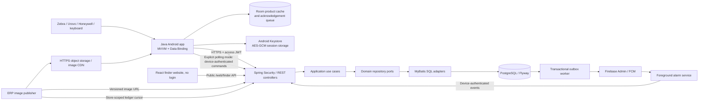

# 1. System architecture

Controllers depend on application use cases; the domain owns repository and push ports. MyBatis and Firebase implement those ports. Spring handles transaction demarcation around application services. DTOs live at the application boundary. MapStruct maps product entities to the exact public lookup contract. Lombok supplies infrastructure logging. Java 8 immutable DTOs represent database projections; the web dashboard uses a dedicated public projection.

Each employee belongs to one store. Store IDs are derived from the authenticated user, never supplied as authority by clients. Manager actions require the MANAGER role; EMPLOYEE can create pending disposals; ERP can publish image metadata and read its store ledger. Existing access tokens expire after 15 minutes; disabled users are rejected immediately when the application resolves the actor. Role changes take effect on the next access-token issue.

Registration requires an employee or manager and produces a random, one-time device secret; only its SHA-256 digest is stored on the server. Token refresh and alarm acknowledgements use that credential, independent of employee sessions. Provision managed devices in person; credential rotation/re-enrollment requires an operator procedure.

The React finder website intentionally has no authentication. Its dedicated `/web/finder/**` API lists all stores/devices and creates/stops finder requests across stores without exposing device secrets or push tokens. Store identity comes from the target device in the database. Such requests have a null requester and system audit entries; authenticated business APIs and device credentials remain separate. Android prompts enrollment after login and no longer contains a remote finder management screen.

Finder insertion and outbox insertion commit together. Workers claim rows using `FOR UPDATE SKIP LOCKED`; delivery is at least once. Duplicate request IDs and STOP tombstones prevent a delivered duplicate from restarting a completed alarm. FCM acceptance is `SENT`, device acknowledgement is `RINGING`, and lack of completion by the deadline is `EXPIRED`. These are not claims of guaranteed delivery. A transient send failure receives bounded exponential retries. Only FCM `UNREGISTERED` invalidates a token; unrelated `INVALID_ARGUMENT` errors must not destroy valid tokens.

Inventory updates compare versions and write an immutable ledger in the same transaction. Disposal confirmation locks the header, processes products in stable ID order, and rolls back the entire transaction if any stock is insufficient. A store-scoped transaction advisory lock serializes ledger writers within a store so its sequence cursor cannot skip a later-committing lower ID. Different stores can progress independently. All future inventory writers must acquire this same lock.

Product images are published before the ERP submits a versioned immutable HTTPS URL. Stale versions are logged and ignored. The backend never downloads a caller-supplied URL. Android uses Glide placeholders for missing/failed images; cached product metadata is visibly marked offline. Inventory mutations require connectivity and are never silently queued.

Android displays a dialog while its activity is visible and a notification while backgrounded. It does not bypass background activity launch restrictions or request overlay/full-screen-intent privileges. High-priority FCM can permit a foreground service start. A downgraded FIND records a delivery error and shows a fallback notification without enabling polling; OS denial also shows a notification. Actual playback failures still report FAILED. Alarm volume changes may be restricted by device policy or DND. Validate the actual managed device fleet.

References: [Android FGS restrictions](https://developer.android.com/develop/background-work/services/fgs/restrictions-bg-start), [FCM token management](https://firebase.google.com/docs/cloud-messaging/manage-tokens), [Spring Boot 3.5 system requirements](https://docs.spring.io/spring-boot/3.5/system-requirements.html).

Android defaults to `finderTransport=fcm`: no polling service or periodic FCM health requests. Only an APK built with `finderTransport=polling` starts the specialUse foreground service and fetches commands every 5 seconds; that build ignores FCM finder messages. FCM failures and recovery never switch the configured transport. See [polling and fleet power policy](15-finder-polling.md).
