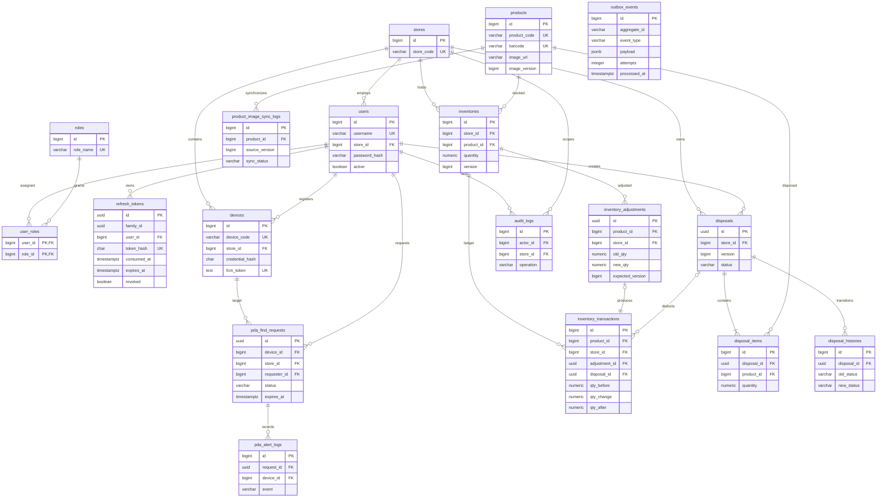

# 2. Database ERD

The authoritative schema is defined by V1 through V6 in `pda-management/src/main/resources/db/migration/`. The former single V1 is retained under `db/legacy` for existing databases; see the backend README for selecting the migration history. All timestamps use UTC-capable `TIMESTAMPTZ`. Quantities use `NUMERIC(18,2)` and Java `BigDecimal`. Composite foreign keys prevent cross-store user/device associations. Stock is unique per `(store_id, product_id)`; disposal products are unique per header. A partial unique index permits only one active finder request per PDA.

The ledger checks `before + change = after`, nonnegative stock and the correct reference type. Completed financial/stock history is retained instead of cascading deletes. The outbox deliberately holds an opaque aggregate ID; business creation and enqueue occur within one transaction. Database numeric constraints complement API precision validation.
