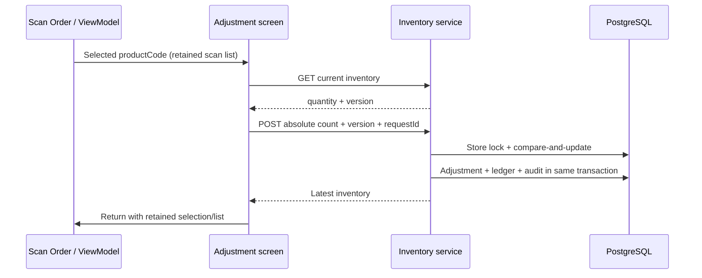

# 10. Sequence diagrams

```mermaid
sequenceDiagram
 participant M as Manager
 participant API as Backend
 participant DB as PostgreSQL
 participant W as Outbox worker
 participant F as FCM
 participant D as Android PDA
 M->>API: POST /pda/find
 API->>API: Validate manager and store
 API->>DB: Transaction: request + outbox + audit
 API-->>M: QUEUED, deadline
 W->>DB: Claim due row (SKIP LOCKED)
 W->>F: High-priority data push with expiry
 F-->>W: Accepted / invalid token / transient failure
 W->>DB: SENT or retry; push exhaustion leaves HTTP polling available
 F->>D: Deliver if reachable before expiry
 D->>D: Start foreground alarm; show notification/dialog
 D->>API: Device-authenticated RINGING event
 API->>DB: Log RINGING
 D->>D: Stop button / timeout; restore volume
 D->>API: STOPPED event (durable retry if offline)
 API->>DB: Terminal status + log
```



```mermaid
sequenceDiagram
 participant UI as Disposal detail
 participant API as Disposal service
 participant DB as PostgreSQL
 UI->>API: Confirm(id, version)
 API->>DB: Store lock then header FOR UPDATE
 alt Already confirmed
  API-->>UI: Existing result (no deduction)
 else Pending and expected version
  loop Product IDs in sorted order
   API->>DB: Versioned stock update + ledger
  end
  alt Any quantity unavailable or update conflict
   API->>DB: Roll back entire transaction
   API-->>UI: 409; reload
  else All items succeeded
   API->>DB: CONFIRMED + history + audit; commit
   API-->>UI: Confirmed header
  end
 end
```

```mermaid
sequenceDiagram
 participant App as OkHttp
 participant Auth as Auth service
 participant DB as PostgreSQL
 App->>Auth: Request with expired access JWT
 Auth-->>App: 401
 App->>App: Serialize refresh attempts
 App->>Auth: Current refresh JWT
 Auth->>DB: Lock token row; validate hash, expiry and unused state
 alt Consumed or revoked
  Auth->>DB: Revoke family and commit
  Auth-->>App: 401; login required
 else Valid
  Auth->>DB: Consume old token; save new token hash
  Auth-->>App: New access + refresh pair
  App->>App: Encrypt/persist pair, replay original request once
 end
```
