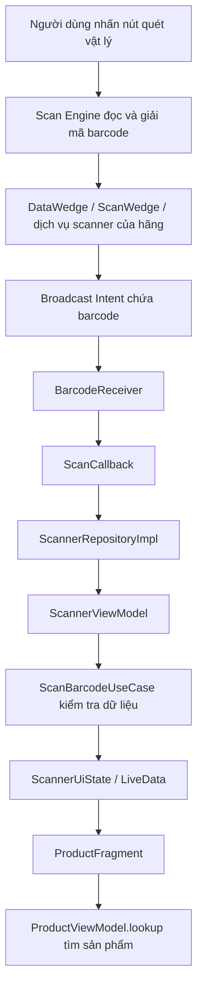
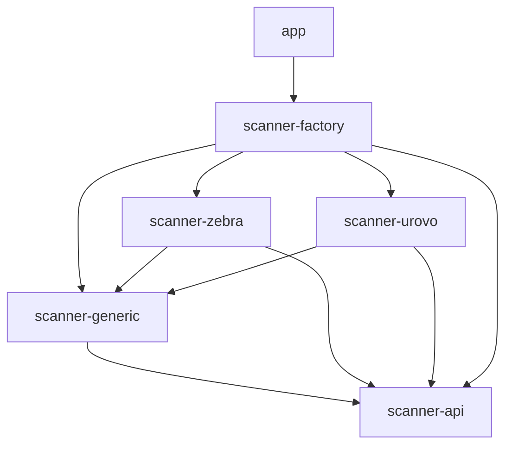

# Luồng hoạt động scanner trong ứng dụng Android

Tài liệu giải thích cách ứng dụng nhận barcode và vai trò của các module `scanner-*` trong phiên bản sử dụng `BroadcastReceiver`.

## 1. Tổng quan

Scanner phần cứng trên PDA đọc và giải mã barcode. Dịch vụ của hãng, chẳng hạn Zebra DataWedge hoặc Urovo ScanWedge, gửi kết quả tới ứng dụng bằng **Broadcast Intent**. Ứng dụng nhận barcode, kiểm tra dữ liệu và thực hiện nghiệp vụ tìm sản phẩm.

Ứng dụng có một lớp `BarcodeReceiver` dùng chung cho các chế độ **ZEBRA, UROVO, HONEYWELL và INTENT**. Mỗi phiên nhận sử dụng cấu hình scanner đang được chọn; ứng dụng không đăng ký đồng thời tất cả các hãng.



Quá trình giải mã barcode diễn ra trước khi broadcast được gửi. `BarcodeReceiver` chỉ nhận dữ liệu đã giải mã, không điều khiển cảm biến hoặc xử lý ảnh từ đầu đọc.

## 2. Vai trò các folder/module

Các folder bên dưới là những Gradle module riêng trong `pda-android`.

| Module | Trách nhiệm | Thành phần chính |
|---|---|---|
| `scanner-api` | Định nghĩa hợp đồng chung, không phụ thuộc Android | `ScannerManager`, `ScannerProvider`, `ScannerConfig`, `ScannerType`, `ScannerCapability`, `ScanCallback`, `ScanResult` |
| `scanner-generic` | Nhận broadcast dùng chung; cung cấp thêm keyboard, camera và intent tùy chỉnh | `BarcodeReceiver`, `IntentScannerManager`, `GenericScannerProvider`, `KeyboardScannerManager`, `CameraScannerManager` |
| `scanner-zebra` | Adapter Zebra sử dụng DataWedge; hỗ trợ software trigger | `ZebraScannerProvider`, `ZebraScannerManager`, `ZebraScannerConfig` |
| `scanner-urovo` | Adapter Urovo ScanWedge; nhận broadcast chung và hỗ trợ software trigger | `UrovoScannerProvider`, `UrovoScannerManager`, `UrovoScannerConfig` |
| `scanner-factory` | Chọn provider phù hợp và tạo scanner manager từ cấu hình | `ScannerFactory` |
| `app` | Đọc thiết lập, tạo repository, xử lý nghiệp vụ và cập nhật giao diện | `ScannerModule`, `ScannerRepositoryImpl`, `ScannerViewModel`, `ScanBarcodeUseCase`, `ProductFragment` |

Quan hệ phụ thuộc chính:



Các module scanner không phụ thuộc vào `app`. Chúng trả về kết quả quét chung; việc tìm sản phẩm hoặc hiển thị lỗi thuộc tầng ứng dụng.

## 3. Provider, Manager và Config khác nhau thế nào?

| Thành phần | Câu hỏi nó giải quyết | Ví dụ |
|---|---|---|
| `ScannerConfig` | Nhận dữ liệu theo cấu hình nào? | Loại `UROVO`, action, payload key, sender permission |
| `ScannerProvider` | Có hỗ trợ loại scanner này không, và tạo manager nào? | `UrovoScannerProvider` hỗ trợ `ScannerType.UROVO` |
| `ScannerManager` | Bắt đầu/dừng phiên nhận và kích hoạt quét như thế nào? | `start(callback)`, `stop()`, `trigger()`, `capabilities()` |
| `ScanCallback` | Trả kết quả hoặc lỗi cho tầng gọi bằng cách nào? | `onScan(ScanResult)`, `onError(String)` |

Ví dụ khi người dùng chọn Urovo:

```text
ScannerConfig(type = UROVO)
    → ScannerFactory.create(config)
    → UrovoScannerProvider.create(config)
    → UrovoScannerManager
    → kế thừa IntentScannerManager
    → đăng ký BarcodeReceiver
```

`UrovoScannerManager` kế thừa cơ chế đăng ký/nhận broadcast từ module chung và bổ sung lệnh software trigger qua Urovo ScanWedge Intent API. Folder riêng giữ các lệnh điều khiển đặc thù của Urovo.

`ZebraScannerManager` cũng kế thừa `IntentScannerManager`, nhưng bổ sung lệnh software trigger của DataWedge. Phiên bản hiện tại không sử dụng Zebra EMDK.

Honeywell được xử lý bởi `GenericScannerProvider` và `IntentScannerManager`; dự án hiện chưa có module `scanner-honeywell` riêng.

## 4. Giai đoạn mở màn hình và đăng ký receiver

Màn hình nhận barcode hiện tại là `ProductFragment` trong chức năng Scan Order.

1. `ProductFragment.onResume()` gọi `ScannerViewModel.start()`.
2. Nếu chưa có repository, ViewModel gọi `ScannerModule.provide(context)`.
3. `ScannerModule` đọc SharedPreferences tên `scanner`, gồm `type`, `action`, `extra` và `permission`.
4. Module tạo `ScannerConfig`, gọi `ScannerFactory` để tạo manager và bọc manager bằng `ScannerRepositoryImpl`.
5. Repository gọi `manager.start(...)`, truyền callback chuyển kết quả tới ViewModel.
6. `IntentScannerManager` kết thúc phiên cũ nếu có, kiểm tra cấu hình và đăng ký một `BarcodeReceiver` mới bằng `ContextCompat.registerReceiver(...)`.

Receiver được đăng ký với `RECEIVER_EXPORTED` để nhận broadcast từ dịch vụ scanner bên ngoài ứng dụng. Filter nhận action đã cấu hình, với intent không có category hoặc có `android.intent.category.DEFAULT`. Sender permission là tùy chọn và phải khớp quyền mà dịch vụ gửi thực sự có.

`start()` ở đây có nghĩa là **bắt đầu lắng nghe kết quả**, không có nghĩa là bật tia quét ngay lập tức.

Ứng dụng chọn scanner theo thiết lập người dùng, chưa tự chọn theo `Build.MANUFACTURER`. Khi chưa có thiết lập, chế độ mặc định là `KEYBOARD`.

## 5. Giai đoạn nhận barcode và tìm sản phẩm

Sau khi người dùng nhấn nút quét vật lý, wedge của hãng gửi một intent gồm hai phần quan trọng:

- **Action**: tên sự kiện để Android chuyển broadcast đến receiver đã đăng ký.
- **Extras**: các trường dữ liệu, gồm nội dung barcode và có thể có loại mã như EAN13 hoặc CODE128.

Ví dụ dữ liệu Zebra với cấu hình mặc định:

```text
action = com.company.pda.SCAN
extras:
  com.symbol.datawedge.data_string = "8931234567890"
  com.symbol.datawedge.label_type  = "LABEL-TYPE-EAN13"
```

`BarcodeReceiver.onReceive()` thực hiện:

1. Bỏ qua nếu phiên nhận đã dừng, intent rỗng hoặc action không khớp.
2. Đọc payload theo `ScannerConfig.dataExtra()`.
3. Chấp nhận chuỗi hoặc byte array giải mã bằng UTF-8; bỏ qua dữ liệu thiếu, sai kiểu hoặc chuỗi trắng.
4. Đọc symbology theo loại scanner, dùng `UNKNOWN` nếu không có giá trị phù hợp.
5. Tạo `com.company.scanner.api.ScanResult` và gọi `ScanCallback.onScan(...)`.

Với Urovo dùng key `barcode_string`, nếu trường này không tồn tại thì receiver thử đọc `barcode` dạng byte. Nếu payload byte có trường `length`, giá trị này phải là số nguyên trong phạm vi mảng byte.

`ScannerRepositoryImpl` chuyển kết quả của scanner API thành `com.company.pda.domain.model.ScanResult`, rồi gọi callback của ViewModel. Hai lớp cùng tên nằm ở hai tầng khác nhau để giữ độc lập giữa thư viện scanner và model nghiệp vụ.

`ScannerViewModel.submit()` gọi `ScanBarcodeUseCase.execute()`. Use case loại bỏ khoảng trắng đầu/cuối và kiểm tra barcode có từ **1 đến 50 ký tự**. Dữ liệu không hợp lệ trở thành trạng thái lỗi; receiver không tự cắt hoặc âm thầm bỏ barcode dài.

ViewModel cập nhật `ScannerUiState` qua LiveData. `ProductFragment` quan sát trạng thái, lấy kết quả, gọi `scanner.consume()` để xóa sự kiện đã xử lý, rồi gọi `ProductViewModel.lookup(barcode)` để tìm sản phẩm. Nếu có lỗi, fragment chuyển lỗi sang ViewModel của màn hình để hiển thị.

## 6. Cấu hình và khác biệt giữa các hãng

| Chế độ | Action mặc định | Payload key mặc định | Symbology key |
|---|---|---|---|
| `ZEBRA` | `com.company.pda.SCAN` | `com.symbol.datawedge.data_string` | `com.symbol.datawedge.label_type` |
| `UROVO` | `android.intent.ACTION_DECODE_DATA` | `barcode_string` | `barcodeType` |
| `HONEYWELL` | `com.company.pda.SCAN` | `data` | `codeId` |
| `INTENT` | `com.company.pda.SCAN` | `data` | `symbology` |

`com.company.pda.SCAN` là action do ứng dụng quy ước, không phải giá trị mặc định chung của mọi thiết bị. Người dùng cần cấu hình wedge gửi đúng action và payload key hoặc sửa thiết lập trong ứng dụng cho khớp với profile thiết bị.

Thao tác trong ứng dụng: mở **Scanner settings**, chọn loại scanner, nhấn **Use selected scanner defaults**, điều chỉnh nếu cần rồi **Save**. Việc lưu sẽ gọi `ScannerViewModel.reload()` để thay repository và áp dụng cấu hình mới. Nút dùng cấu hình mặc định chỉ điền thiết lập phía ứng dụng, không tự cấu hình dịch vụ của hãng.

Với Zebra, bật Barcode input, bật Intent output và chọn **Broadcast Intent** trong DataWedge; gắn profile với `com.company.pda`. Với Urovo hoặc Honeywell, bật chế độ broadcast/intent output tương ứng trên thiết bị. Tắt keyboard output khi dùng broadcast để tránh xử lý một lần quét hai lần.

Adapter Honeywell hiện nhận kết quả từ profile đã được cấu hình; nó không tự claim scanner hoặc thiết lập dịch vụ bằng Honeywell Intent API.

## 7. Nút quét vật lý và software trigger

| Cách kích hoạt | Luồng điều khiển | Hỗ trợ hiện tại |
|---|---|---|
| Nút vật lý trên PDA | Nút → dịch vụ hãng → scan engine → broadcast kết quả | Các thiết bị có wedge được cấu hình tương thích |
| Nút **Trigger configured scanner** trong app | ViewModel → repository → `manager.trigger()` | Zebra DataWedge, Urovo ScanWedge tương thích và camera |

Đối với Zebra, `trigger()` chỉ gửi lệnh khi phiên nhận đang hoạt động:

```text
Intent action: com.symbol.datawedge.api.ACTION
Package:      com.symbol.datawedge
Extra:        com.symbol.datawedge.api.SOFT_SCAN_TRIGGER
Value:        START_SCANNING
```

Kết quả của software trigger vẫn quay về qua `BarcodeReceiver` như khi quét bằng nút vật lý. DataWedge cần có profile đang hoạt động; ứng dụng hiện chưa xác nhận kết quả thực thi lệnh trigger.

Urovo cũng gửi `START_SCANNING`/`STOP_SCANNING`, nhưng dùng action `com.ubx.datawedge.api.ACTION` và extra `SOFT_SCAN_TRIGGER`. Mẫu Urovo giới thiệu Intent API từ ScanWedge `V2.1.19_20230220`, với Android 10 trở lên và bản OS từ 2023-02-20. Cần kiểm tra firmware thiết bị hỗ trợ API này; adapter chưa tự kiểm tra phiên bản hoặc nhận xác nhận lệnh. Xem [hướng dẫn Urovo và nguồn tham khảo](../pda-android/scanner-urovo/README.md). Honeywell và INTENT hiện vẫn dùng nút quét vật lý.

## 8. Dừng, quay lại màn hình và vòng đời receiver

```text
ProductFragment.onPause()
    → ScannerViewModel.stop()
    → ScannerRepositoryImpl.stop()
    → ScannerManager.stop()
    → vô hiệu hóa callback
    → unregisterReceiver()
```

Khi rời màn hình hoặc ứng dụng bị pause, receiver của phiên nhận được hủy đăng ký. Callback cũng bị vô hiệu hóa để receiver cũ không xử lý kết quả đến muộn. Gọi `stop()` nhiều lần không đăng ký thêm hoặc hủy lại một receiver đã được dừng.

Zebra và Urovo gửi thêm `STOP_SCANNING` theo giao thức riêng của hãng khi kết thúc phiên đang hoạt động, rồi hủy receiver trong `finally`. `ScannerViewModel.onCleared()` cũng gọi `stop()` để giải phóng phiên nhận.

Khi trở lại màn hình, `onResume()` gọi `start()` để đăng ký một phiên mới. Không có receiver khai báo trong manifest để xử lý barcode khi màn hình quét đã dừng.

## 9. Keyboard và camera

Hai chế độ này có cùng hợp đồng `ScannerManager` nhưng nhận kết quả theo cách khác:

- **KEYBOARD**: scanner nhập ký tự vào ô đang focus như bàn phím. Khi nhấn Enter hoặc nút tìm kiếm, giao diện gọi `ScannerViewModel.submit(...)`. `KeyboardScannerManager` không đăng ký receiver.
- **CAMERA**: `CameraScannerManager` mở Google code scanner bằng software trigger, nhận kết quả từ callback của thư viện rồi chuyển qua repository tới ViewModel. Nó không sử dụng broadcast từ wedge.

Nhờ dùng chung hợp đồng, nghiệp vụ kiểm tra barcode và tìm sản phẩm có thể dùng lại cho nhiều phương thức nhập.

## 10. Vì sao tách theo module và hãng?

Thiết kế này giữ các khác biệt về giao thức, cấu hình và điều khiển thiết bị ở tầng scanner. Màn hình chỉ nhận `ScanResult`, không cần chứa các nhánh kiểm tra hãng để đọc intent.

Các cách tổ chức thể hiện trong code:

| Cách tổ chức | Thể hiện trong dự án |
|---|---|
| Factory và provider | `ScannerFactory` chọn provider rồi tạo manager |
| Strategy | Các manager cung cấp cách nhận/kích hoạt khác nhau dưới cùng `ScannerManager` |
| Adapter | Các adapter chuyển giao tiếp scanner của hãng thành hợp đồng scanner chung |
| Callback và quan sát trạng thái | `ScanCallback` chuyển kết quả; LiveData thông báo cho giao diện |
| Repository | `ScannerRepositoryImpl` nối tầng scanner với model và hợp đồng nghiệp vụ |

Nếu thêm hãng có broadcast tương thích, có thể cấu hình chế độ `INTENT`. Nếu hãng cần lệnh điều khiển hoặc giao thức riêng, có thể bổ sung module, provider và manager tương ứng, rồi đăng ký provider trong factory. Các định dạng payload hoặc key symbology mới cũng cần bổ sung xử lý nếu khác cơ chế generic hiện tại.

## 11. Các file nên đọc theo thứ tự

1. [ScannerManager](../pda-android/scanner-api/src/main/java/com/company/scanner/api/ScannerManager.java) và [ScannerConfig](../pda-android/scanner-api/src/main/java/com/company/scanner/api/ScannerConfig.java): hợp đồng và cấu hình.
2. [ScannerFactory](../pda-android/scanner-factory/src/main/java/com/company/scanner/factory/ScannerFactory.java): chọn provider.
3. [IntentScannerManager](../pda-android/scanner-generic/src/main/java/com/company/scanner/generic/IntentScannerManager.java): đăng ký/hủy receiver.
4. [BarcodeReceiver](../pda-android/scanner-generic/src/main/java/com/company/scanner/generic/BarcodeReceiver.java): đọc và chuẩn hóa payload.
5. [ZebraScannerManager](../pda-android/scanner-zebra/src/main/java/com/company/scanner/zebra/ZebraScannerManager.java) và [UrovoScannerManager](../pda-android/scanner-urovo/src/main/java/com/company/scanner/urovo/UrovoScannerManager.java): adapter từng hãng.
6. [ScannerModule](../pda-android/app/src/main/java/com/company/pda/di/ScannerModule.java) và [ScannerRepositoryImpl](../pda-android/app/src/main/java/com/company/pda/data/repository/ScannerRepositoryImpl.java): cấu hình và kết nối các tầng.
7. [ScannerViewModel](../pda-android/app/src/main/java/com/company/pda/presentation/scanner/ScannerViewModel.java) và [ScanBarcodeUseCase](../pda-android/app/src/main/java/com/company/pda/domain/usecase/ScanBarcodeUseCase.java): xử lý kết quả và kiểm tra nghiệp vụ.
8. [ProductFragment](../pda-android/app/src/main/java/com/company/pda/presentation/product/ProductFragment.java): vòng đời và hiển thị kết quả.

Hướng dẫn cấu hình và thử broadcast: [Broadcast scanner integration](../pda-android/scanner-generic/README.md). Thiết lập riêng cho Zebra: [Zebra DataWedge scanner](../pda-android/scanner-zebra/README.md). Broadcast giả lập kiểm tra được đường nhận dữ liệu của ứng dụng; khả năng quét phần cứng vẫn cần kiểm tra trên PDA thật.
