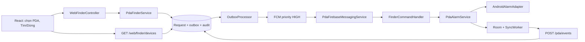

# 14. Luồng tìm PDA: website React → backend → Android

## Vai trò

Website [pda-web](../pda-web/README.md) hiển thị tất cả thiết bị theo cửa hàng, gửi yêu cầu Tìm/Dừng và cập nhật trạng thái. Web không đăng nhập. Android chỉ đăng ký thiết bị sau đăng nhập, nhận FIND/STOP, phát/dừng chuông và gửi ACK; màn hình PDA management đã được bỏ.

## Đăng ký sau đăng nhập

Home mở form nếu PDA chưa có ID/secret. Nhân viên hoặc quản lý nhập mã tài sản/tên (đã có giá trị gợi ý), bấm Register. `POST /devices/register` có JWT, cửa hàng lấy từ tài khoản. Android lưu secret, đồng bộ FCM token. Lần đăng nhập sau không tạo thêm thiết bị; cửa hàng đăng ký không tự đổi theo tài khoản khác. Có nút Register trên Home để làm lại nếu trước đó bỏ qua form.

Không cần token ngay lúc đăng ký; khi có token SDK, `SyncWorker` cập nhật bằng `PUT /devices/token` với credential thiết bị. Máy chọn FCM cần token hợp lệ để nhận lệnh, không tự chuyển polling khi thiếu token.

## Gửi yêu cầu từ web

1. `GET /web/finder/devices` trả các cửa hàng, tất cả thiết bị và request gần nhất, không trả credential/token.
2. `POST /web/finder/devices/{deviceId}/find` không cần JWT/body. Backend tìm cửa hàng thực của thiết bị.
3. Cùng transaction: xử lý request cũ hết hạn, tạo QUEUED, ghi log, outbox FIND và audit `PDA_FIND_WEB`. Một PDA chỉ có một request active; trùng còn hạn trả 409.
4. Request từ web có `requester_id=null`; migration V7 áp dụng cho cả hai lịch sử Flyway.
5. Timeout mặc định 60 giây, giới hạn 10–300. API trả QUEUED chưa có nghĩa đã gửi FCM.

## Gửi và nhận lệnh

Scheduler xử lý outbox, adapter gửi data message `command/requestId/expiresAt`, Android priority HIGH và TTL theo thời gian còn lại. SENT chỉ là Firebase chấp nhận gửi. Token UNREGISTERED bị vô hiệu hóa; lỗi khác có retry giới hạn.

Android mặc định `finderTransport=fcm`: không chạy polling service/health định kỳ. APK chọn `polling` mới gọi `/pda/commands`, bỏ qua message FCM. Hai transport dùng cùng handler, kiểm tra UUID, hạn dùng, dấu handled và phiên đang reo. STOP ghi tombstone để FIND đến muộn không khởi động lại. Xem [cấu hình transport](16-fcm-to-polling-fallback.md).

## Phát âm thanh

`FinderCommandHandler → AlarmController → PdaAlarmService`.

Foreground service mở notification, chọn adapter bằng DeviceModule/DeviceAlarmFactory, kiểm tra DND/audio focus, lưu và tăng âm lượng alarm, phát `pda_alarm.mp3` lặp. AndroidAlarmPlayer dùng USAGE_ALARM và ưu tiên loa tích hợp; volume được khôi phục khi kết thúc. Các adapter Zebra/Urovo hiện dùng API Android công khai, không có đặc quyền tự vượt DND.

Lỗi phát báo FAILED; FIND FCM bị hạ priority hoặc start service bị chặn hiện notification dự phòng, không tự bật polling. **Finder sound settings** chỉ test âm thanh tại PDA, không gửi yêu cầu tìm thiết bị khác. Chi tiết code ở [20-fcm-to-pda-alarm-guide.md](20-fcm-to-pda-alarm-guide.md).

## ACK và dừng

RINGING/STOPPED/FAILED được lưu Room rồi SyncWorker gửi `POST /pda/events` bằng ID/secret của PDA. Backend kiểm tra đúng thiết bị/request, không cho trạng thái terminal quay lại active. Website refresh danh sách mỗi khoảng 5 giây và có nút Làm mới; cùng endpoint mang trạng thái request gần nhất.

Nút Dừng trên web gọi `POST /web/finder/requests/{id}/stop`: cập nhật STOPPED, outbox STOP và audit; có thể dừng trực tiếp tại notification/dialog PDA hoặc tự dừng khi hết hạn. STOPPED từ web chưa chứng minh PDA đã nhận STOP; thiết bị offline vẫn tự kiểm tra deadline cục bộ. RINGING chưa chứng minh người dùng đã nghe loa.

## API và tài liệu

Các API website công khai nằm trong [tài liệu React](21-react-device-finder.md), bao gồm xóa thiết bị và chẩn đoán cấu hình gửi. Các API manager cũ giữ để tương thích và vẫn yêu cầu JWT; Android mới không còn màn hình hoặc lời gọi tìm/dừng từ xa. Token, ACK và polling tiếp tục dùng device credential.

Để vận hành cần scheduler, cấu hình Firebase cho FCM hoặc APK polling rõ ràng, mạng và chính sách âm thanh/chạy nền của PDA. [Triển khai](11-deployment.md), [trách nhiệm class](19-device-finder-class-responsibilities.md), [kết quả kiểm tra](verification.md).
