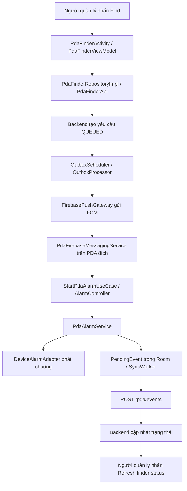

# Luồng hoạt động tìm thiết bị PDA

Tài liệu mô tả chức năng **PDA management / tìm thiết bị** theo code hiện tại: từ thao tác trên màn hình, qua backend và Firebase Cloud Messaging (FCM), tới phát chuông trên PDA đích và báo trạng thái về server.

## 1. Chức năng tìm thiết bị làm gì?

Người dùng chọn một PDA đã đăng ký để yêu cầu máy đó phát chuông, từ đó tìm máy bằng âm thanh. Luồng hiện tại không lấy tọa độ GPS hoặc hiển thị vị trí trên bản đồ.

Có hai vai trò thiết bị cần phân biệt:

- **Máy gửi yêu cầu**: người quản lý mở PDA management, chọn PDA cần tìm và xem trạng thái.
- **PDA đích**: nhận lệnh FCM, chạy dịch vụ phát chuông và báo kết quả về backend. PDA đích không cần mở màn hình PDA management để xử lý lệnh.

Backend yêu cầu quyền `MANAGER` cho đăng ký thiết bị, xem danh sách, tạo yêu cầu tìm, xem trạng thái và dừng từ xa. Danh sách và yêu cầu được giới hạn theo cửa hàng của người dùng.



## 2. Các folder và thành phần chính

### Phía Android

| Folder/module | Vai trò |
|---|---|
| `app/.../presentation/pdafinder` | Màn hình danh sách PDA, ViewModel tìm/dừng/xem trạng thái và màn hình kiểm tra loa tại chỗ |
| `app/.../data/repository` | `PdaFinderRepositoryImpl` nối nghiệp vụ với API và điều khiển chuông tại máy |
| `app/.../data/remote/api` | `PdaFinderApi` khai báo các endpoint Retrofit |
| `app/.../domain/usecase` | `StartPdaAlarmUseCase`, `StopPdaAlarmUseCase` chuyển yêu cầu tới repository để điều khiển chuông cục bộ |
| `app/.../infrastructure/firebase` | Nhận FCM, lưu/cập nhật token và đồng bộ các sự kiện về backend |
| `app/.../infrastructure/alarm` | Khởi động/dừng foreground service, quản lý notification, thời hạn và phiên phát chuông |
| `app/.../infrastructure/device` | `DeviceManager` lưu định danh và credential đăng ký của PDA |
| `app/.../common/util/AlarmAwareActivity` | Hiển thị hộp thoại tìm thiết bị khi một màn hình kế thừa lớp này đang mở |
| `device-api` | Hợp đồng `DeviceAlarmAdapter`, `AlarmPolicy`, `AlarmResult`, player, volume và audio mode |
| `device-factory` | Chọn adapter theo manufacturer; hỗ trợ kiểm tra/khôi phục thiết lập âm thanh qua `DeviceAudioSetup` |
| `device-android` | Phát âm thanh, quản lý audio focus, âm lượng, mute và kiểm tra điều kiện phát |
| `device-zebra`, `device-urovo` | Adapter theo hãng; hiện dùng lại cơ chế âm thanh Android chung |

Các module `device-*` phục vụ âm thanh/thông tin thiết bị. Các module `scanner-*` phục vụ barcode; chúng không xử lý lệnh tìm PDA.

`DeviceAlarmFactory` tự chọn adapter dựa trên manufacturer: Zebra, Urovo hoặc Android mặc định. Đây là cơ chế chọn riêng với scanner, vốn được người dùng chọn trong Scanner settings.

### Phía backend

| Thành phần | Vai trò |
|---|---|
| `DeviceController`, `DeviceService` | Đăng ký PDA, danh sách thiết bị, xác thực credential và cập nhật FCM token |
| `FinderController`, `FinderService` | Tạo/dừng yêu cầu, truy vấn trạng thái và tiếp nhận sự kiện từ PDA đích |
| `FinderMapper`, `DeviceMapper` | Đọc/ghi yêu cầu, log và thông tin thiết bị bằng MyBatis |
| `OutboxScheduler`, `OutboxProcessor` | Xử lý lệnh chờ gửi, retry và đánh dấu yêu cầu hết hạn |
| `FirebasePushGateway` | Gửi FCM data message tới token của PDA đích |

## 3. Đăng ký PDA trước khi tìm

Trên PDA cần được tìm, mở Home và chọn **Register this PDA**. Luồng đăng ký:

1. `FcmTokenManager.initialize()` lấy token từ Firebase nếu Firebase đã được cấu hình. Khi token thay đổi, `refreshed()` lưu token và lên lịch đồng bộ.
2. Người quản lý nhập mã tài sản và tên thiết bị.
3. `PdaFinderRepositoryImpl.register()` đọc token đã lưu, gọi `POST /devices/register`. Nếu chưa có token, vẫn đăng ký được để nhận lệnh qua polling.
4. Backend tạo thiết bị gắn với cửa hàng, lưu FCM token và bản hash của device secret.
5. Backend trả `deviceId` và `deviceSecret`; `DeviceManager.registered()` lưu chúng bằng `TokenStorage`.
6. `SyncWorker` dùng hai giá trị này để xác thực khi cập nhật token và báo sự kiện.

Token thay đổi được cập nhật qua `PUT /devices/token`, với header `X-Device-Id` và `X-Device-Secret`. Việc đồng bộ dùng credential của thiết bị, không dùng quyền manager cho từng sự kiện phát chuông.

`reachable` trong danh sách hiện chỉ có nghĩa là backend đang lưu FCM token khác null. Nó không phải kết quả kiểm tra online và không bảo đảm máy sẽ nhận lệnh ngay.

## 4. Người dùng nhấn Find ở đâu?

Home có nút **PDA management** mở `PdaFinderActivity`.

Màn hình gọi `PdaFinderViewModel.load()` để lấy danh sách thiết bị qua `GET /devices`. Với mỗi thiết bị, Activity tạo nút gọi:

```java
() -> vm.find(d.id)
```

Luồng gửi yêu cầu:

```text
PdaFinderActivity: chọn thiết bị
    → PdaFinderViewModel.find(deviceId)
    → PdaFinderRepositoryImpl.find(deviceId)
    → PdaFinderApi.find(...)
    → POST /pda/find
    → FinderController.find(...)
    → FinderService.find(deviceId)
```

`PdaFinderViewModel` chạy công việc API qua `AsyncViewModel.run(...)`, rồi cập nhật `PdaFinderUiState` để hiển thị request ID và trạng thái.

Ví dụ request body:

```json
{"deviceId": 12}
```

Backend kiểm tra thiết bị thuộc cùng cửa hàng, tạo UUID cho yêu cầu, ghi trạng thái `QUEUED`, log và lệnh `FIND` trong outbox cùng transaction. Backend trả yêu cầu vừa tạo về màn hình; tại thời điểm này PDA đích có thể chưa nhận được lệnh.

Thời hạn lấy từ `app.finder-timeout-seconds`, mặc định 60 giây, được giới hạn trong khoảng 10–300 giây. Thời gian được tính từ lúc tạo yêu cầu, không phải từ lúc PDA bắt đầu phát chuông.

## 5. Backend gửi lệnh FCM như thế nào?

Khi scheduler được bật, `OutboxScheduler` chạy với fixed delay 1 giây; mỗi lượt gọi xử lý hết hạn rồi xử lý một lệnh outbox đủ điều kiện.

`OutboxProcessor` kiểm tra yêu cầu và token, rồi gọi `FirebasePushGateway.send(...)`. Lệnh `FIND` đã hết hạn hoặc thuộc yêu cầu kết thúc sẽ được bỏ qua. Lệnh gửi được lưu trong outbox nên không phụ thuộc việc màn hình người gửi còn mở hay không.

Payload FCM có dạng:

```json
{
  "command": "FIND",
  "requestId": "<UUID của yêu cầu>",
  "expiresAt": "<thời điểm hết hạn dạng ISO-8601>"
}
```

Gateway đặt Android priority là `HIGH`, TTL theo thời gian còn lại. Sau khi lời gọi gửi thành công, backend chuyển `QUEUED` sang `SENT` nếu yêu cầu vẫn ở trạng thái đó.

Nếu token bị Firebase báo không còn đăng ký, backend vô hiệu hóa token tương ứng nhưng giữ yêu cầu cho polling tới khi hết hạn. Lỗi gửi tạm thời được ghi log và retry trong giới hạn số lần/thời hạn của processor.

**`SENT` chỉ thể hiện bước gửi tới FCM thành công, chưa chứng minh PDA đã nhận hoặc đã phát chuông.**

## 6. PDA đích nhận lệnh và phát chuông

Service kiểm tra `GET /pda/fcm-health` mỗi 15 giây. Chỉ khi PDA hoặc backend ghi nhận lỗi FCM mới gọi `GET /pda/commands` để nhận FIND/STOP theo nhịp 5 giây. Service chạy nền với thông báo thường trực trên PDA đã cấu hình chính sách pin. Xem [điều kiện polling](15-finder-polling.md).

`PdaFirebaseMessagingService.onMessageReceived()` chuyển payload tới `FinderCommandHandler` dùng chung với polling để kiểm tra:

- `requestId` phải có và là UUID hợp lệ.
- `STOP` được chuyển sang luồng dừng.
- `FIND` phải chưa được đánh dấu `handled:<requestId>` và chưa hết hạn.
- Message `FIND` phải có priority thực nhận là `HIGH`.

Nếu priority không đạt, app ghi lỗi delivery để bật polling và hiện notification dự phòng. Nếu khởi động chuông ném lỗi runtime, app hiện notification nhưng không tự coi lỗi Android này là lỗi FCM. Lỗi phát âm thanh thực tế vẫn báo `FAILED`.

Luồng bắt đầu chuông hợp lệ:

```text
PdaFirebaseMessagingService
    → StartPdaAlarmUseCase.execute(requestId, expiry)
    → PdaFinderRepositoryImpl.startLocal(...)
    → AlarmController.start(...)
    → ContextCompat.startForegroundService(...)
    → PdaAlarmService.onStartCommand(...)
```

`PdaAlarmService` thực hiện:

1. Tạo foreground notification “This PDA is being located” có nút **Stop alarm**.
2. Kiểm tra lại ID, deadline và dấu đã xử lý; bỏ qua yêu cầu trùng với phiên đang chạy.
3. Nếu có phiên khác, giải phóng phiên cũ trước khi nhận phiên mới.
4. Tạo adapter qua `DeviceModule.alarm()` và `DeviceAlarmFactory`.
5. Tạo `AlarmPolicy` với âm thanh `raw/pda_alarm`, deadline của request và yêu cầu tăng âm lượng alarm.
6. Gọi `adapter.start(...)` và kiểm tra kết quả.
7. Nếu phát thành công theo kiểm tra phần mềm: xếp sự kiện `RINGING`, phát broadcast nội bộ `SHOW_ALARM`, đặt timer dừng và kiểm tra âm thanh mỗi 500 ms.
8. Nếu thất bại: xếp sự kiện `FAILED`, lưu lý do lỗi để xem tại Finder sound settings rồi dừng service.

Service dùng `START_NOT_STICKY`. Luồng tìm này không có cơ chế tự phát lại chuông vô thời hạn khi tiến trình bị hủy.

## 7. Adapter âm thanh và các hãng PDA

```text
DeviceModule.alarm(context)
    → DeviceAlarmFactory.create()
    → ZebraAlarmAdapter / UrovoAlarmAdapter / AndroidAlarmAdapter
    → player + volume controller + audio mode controller
```

Các adapter Zebra và Urovo hiện dùng triển khai âm thanh Android chung. Chúng không sử dụng DataWedge/ScanWedge để phát chuông.

Triển khai hiện tại dùng alarm audio, lưu âm lượng/mute trước đó, tăng âm lượng alarm và yêu cầu đầu ra loa tích hợp. Adapter kiểm tra audio focus, trạng thái player, âm lượng và chính sách âm thanh; một phiên chuông hoặc sound test khác đang sở hữu adapter cũng có thể khiến phiên mới thất bại.

Ứng dụng không tự tắt DND toàn cục. Nếu chính sách DND chặn alarm hoặc điều kiện âm thanh không cho phép phát, kết quả là `FAILED`. Khi kết thúc, adapter giải phóng player/audio focus và khôi phục âm lượng/mute; snapshot còn lưu hỗ trợ thử khôi phục ở lần mở ứng dụng tiếp theo nếu tiến trình bị hủy hoặc việc khôi phục bị chặn.

**`RINGING` nghĩa là phát âm thanh đã vượt qua các kiểm tra phần mềm. Nó không chứng minh có người nghe thấy loa.** Chi tiết triển khai và các tình huống thử trên thiết bị xem [Finder audio and silent mode](12-finder-audio.md).

## 8. Báo trạng thái từ PDA về màn hình người tìm

Trạng thái không được gửi trực tiếp từ service tới màn hình trên máy người tìm. Nó đi qua backend:

```text
PdaAlarmService
    → SyncWorker.event(requestId, status)
    → lưu PendingEvent vào Room
    → WorkManager chạy SyncWorker khi có mạng
    → POST /pda/events
    → FinderService.event(...)
    → cập nhật request/log trong database
```

Worker gửi `X-Device-Id` và `X-Device-Secret`. Backend xác thực credential, kiểm tra request thuộc đúng PDA, rồi cập nhật trạng thái nếu request còn đang hoạt động. Một sự kiện `RINGING` tới sau deadline được xử lý thành `EXPIRED`.

`SyncWorker` dùng ràng buộc có mạng và exponential backoff bắt đầu từ 30 giây. Khi đồng bộ thành công, event được xóa khỏi hàng chờ cục bộ. Vì vậy trạng thái trên server có thể chậm hơn trạng thái thực tế của loa.

Trên máy người tìm, nút **Refresh finder status** gọi:

```text
PdaFinderViewModel.refresh()
    → repository.status(requestId)
    → GET /pda/find/{id}
    → cập nhật PdaFinderUiState
```

Màn hình hiện dùng refresh thủ công, chưa tự polling định kỳ hoặc nhận cập nhật trạng thái qua WebSocket.

## 9. Dừng chuông bằng những cách nào?

### Dừng từ máy gửi yêu cầu

Nút **Stop alarm** trên PDA management gọi `PdaFinderViewModel.stop()`, gửi `POST /pda/stop` với request ID.

Backend chuyển yêu cầu đang hoạt động sang `STOPPED`, ghi `STOP_REQUESTED` và đưa lệnh `STOP` vào outbox. FCM chuyển lệnh tới PDA đích:

```text
FCM STOP
    → PdaFirebaseMessagingService
    → StopPdaAlarmUseCase
    → repository.stopLocal(requestId)
    → AlarmController.stop(requestId)
```

Controller đánh dấu `handled:<requestId>` và chỉ dừng service nếu ID trùng phiên đang chạy. Nếu lệnh STOP đến trước FIND, dấu này giúp ngăn FIND đến muộn bật chuông trở lại.

Màn hình người gửi xóa request đang hiển thị và báo “Stop requested” sau khi API thành công. **Đây là xác nhận server nhận yêu cầu dừng, chưa bảo đảm PDA đích đã nhận STOP.** Nếu PDA mất mạng, chuông còn có timer cục bộ để kết thúc theo deadline.

### Dừng tại PDA đích

- Nhấn **Stop alarm** trên foreground notification.
- Nhấn **Stop alarm** trong hộp thoại của `AlarmAwareActivity`.

Service phát `SHOW_ALARM` trong phạm vi package để màn hình đang mở hiển thị hộp thoại. Activity đăng ký receiver nội bộ khi resume và kiểm tra cả `activeId`, nên có thể hiển thị phiên chuông đang chạy khi người dùng mở lại màn hình.

### Tự dừng và giải phóng

`AlarmTimeoutManager` dừng service khi hết thời gian còn lại. Lỗi kiểm tra âm thanh hoặc mất audio focus cũng làm service dừng với kết quả thất bại.

Khi giải phóng phiên, service hủy timer và monitor, gọi `adapter.stop()`, lưu dấu đã xử lý và xếp sự kiện `STOPPED` nếu phiên không thất bại. Phiên đã `FAILED` không gửi thêm `STOPPED` để ghi đè lỗi. Khi service bị hủy, foreground notification được gỡ.

Rời màn hình trên máy gửi không gửi STOP tự động. Việc pause một `AlarmAwareActivity` trên PDA đích chỉ đóng hộp thoại/hủy receiver giao diện, không tự dừng foreground alarm.

## 10. Ý nghĩa trạng thái trên server

| Trạng thái | Ý nghĩa trong code hiện tại |
|---|---|
| `QUEUED` | Yêu cầu đã tạo, có lệnh chờ gửi trong outbox |
| `SENT` | Bước gửi FIND qua gateway thành công; chưa có xác nhận phát chuông |
| `RINGING` | PDA đã báo phát chuông vượt qua kiểm tra phần mềm |
| `STOPPED` | Server nhận yêu cầu dừng từ người quản lý, hoặc nhận sự kiện dừng từ PDA; cần xem nguồn sự kiện để phân biệt |
| `FAILED` | Lỗi token/gửi lệnh hoặc PDA báo không thể tiếp tục phát chuông |
| `EXPIRED` | Deadline đã qua khi yêu cầu còn hoạt động, hoặc RINGING tới server quá muộn |

Luồng thường gặp là `QUEUED → SENT → RINGING → STOPPED`, nhưng không bắt buộc đi qua mọi bước. Yêu cầu có thể dừng/thất bại trước khi phát chuông. `FinderMapper` chỉ cho cập nhật trạng thái tổng quát khi trạng thái hiện tại là `QUEUED`, `SENT` hoặc `RINGING`, tránh sự kiện đến muộn làm sống lại request đã kết thúc.

Timer trên PDA và kiểm tra hết hạn ở backend chạy độc lập. Nếu server đánh dấu `EXPIRED` trước khi nhận sự kiện dừng, trạng thái cuối có thể vẫn là `EXPIRED` dù chuông đã dừng tại máy.

## 11. Finder sound settings khác gì Find từ xa?

`FinderSoundActivity` là màn hình cấu hình và thử loa **trên chính PDA đang thao tác**. Nút **Test this PDA speaker (5 seconds)** gọi adapter trực tiếp, không tạo request backend và không gửi FCM.

Màn hình này cho xem lý do lỗi âm thanh gần nhất, mở thiết lập DND và thử loa. Sound test tự dừng sau 5 giây, khi nhấn Stop hoặc khi rời màn hình. Đây là cách kiểm tra âm thanh cục bộ; thử thành công chưa xác nhận đường gửi FCM từ backend hoạt động.

## 12. Các API liên quan

| API | Mục đích | Xác thực |
|---|---|---|
| `POST /devices/register` | Đăng ký PDA và token | Người dùng có quyền manager |
| `GET /devices` | Danh sách PDA cùng cửa hàng | Người dùng có quyền manager |
| `PUT /devices/token` | Cập nhật FCM token | Device ID + device secret |
| `POST /pda/find` | Tạo yêu cầu tìm | Người dùng có quyền manager |
| `GET /pda/find/{id}` | Đọc trạng thái yêu cầu | Người dùng có quyền manager |
| `POST /pda/stop` | Yêu cầu dừng từ xa | Người dùng có quyền manager |
| `POST /pda/events` | PDA báo RINGING/STOPPED/FAILED | Device ID + device secret |
| `GET /pda/commands` | PDA lấy FIND/STOP dự phòng qua HTTP | Device ID + device secret |
| `GET /pda/fcm-health` | Kiểm tra lỗi FCM phía backend để quyết định polling | Device ID + device secret |

Các đường dẫn trên là đường dẫn endpoint trong code; app ghép chúng với API base URL được cấu hình.

## 13. Các file nên đọc theo thứ tự

1. [PdaFinderActivity](../pda-android/app/src/main/java/com/company/pda/presentation/pdafinder/PdaFinderActivity.java) và [PdaFinderViewModel](../pda-android/app/src/main/java/com/company/pda/presentation/pdafinder/PdaFinderViewModel.java): các nút và trạng thái màn hình.
2. [PdaFinderRepositoryImpl](../pda-android/app/src/main/java/com/company/pda/data/repository/PdaFinderRepositoryImpl.java) và [PdaFinderApi](../pda-android/app/src/main/java/com/company/pda/data/remote/api/PdaFinderApi.java): gọi server và điều khiển chuông cục bộ.
3. [PdaFinderService](../pda-management/src/main/java/com/company/pda/application/pdafinder/service/PdaFinderService.java): tạo/dừng yêu cầu và xử lý acknowledgement.
4. [OutboxProcessor](../pda-management/src/main/java/com/company/pda/application/pdafinder/service/OutboxProcessor.java) và [FirebaseNotificationAdapter](../pda-management/src/main/java/com/company/pda/infrastructure/firebase/FirebaseNotificationAdapter.java): gửi FCM, retry và hết hạn.
5. [PdaFirebaseMessagingService](../pda-android/app/src/main/java/com/company/pda/infrastructure/firebase/PdaFirebaseMessagingService.java): điểm nhận FIND/STOP trên PDA đích.
6. [AlarmController](../pda-android/app/src/main/java/com/company/pda/infrastructure/alarm/AlarmController.java) và [PdaAlarmService](../pda-android/app/src/main/java/com/company/pda/infrastructure/alarm/PdaAlarmService.java): phiên chuông, notification và cleanup.
7. [DeviceAlarmFactory](../pda-android/device-factory/src/main/java/com/company/device/factory/DeviceAlarmFactory.java) và [AndroidAlarmAdapter](../pda-android/device-android/src/main/java/com/company/device/android/AndroidAlarmAdapter.java): chọn hãng và phát âm thanh.
8. [SyncWorker](../pda-android/app/src/main/java/com/company/pda/infrastructure/firebase/SyncWorker.java): hàng chờ trạng thái và đồng bộ về backend.
9. [FinderSoundActivity](../pda-android/app/src/main/java/com/company/pda/presentation/pdafinder/FinderSoundActivity.java): thiết lập và thử loa cục bộ.

Để chạy cần bật scheduler, đăng ký PDA và cho phép alarm audio trên máy đích. Đường push cần cấu hình Firebase cho app/backend; đường polling không cần Firebase nhưng cần cấu hình chạy nền/pin theo [hướng dẫn polling](15-finder-polling.md). Xem [hướng dẫn triển khai](11-deployment.md), [kiểm tra âm thanh](12-finder-audio.md) và [kết quả kiểm chứng hiện có](verification.md). Tài liệu này giải thích code, không xác nhận đã kiểm thử live FCM hoặc loa trên PDA thật.
