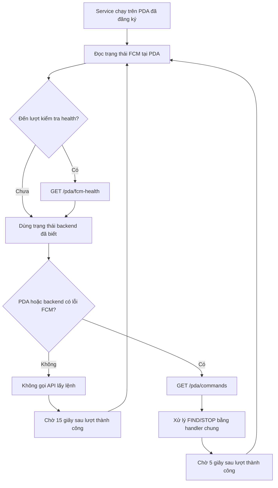
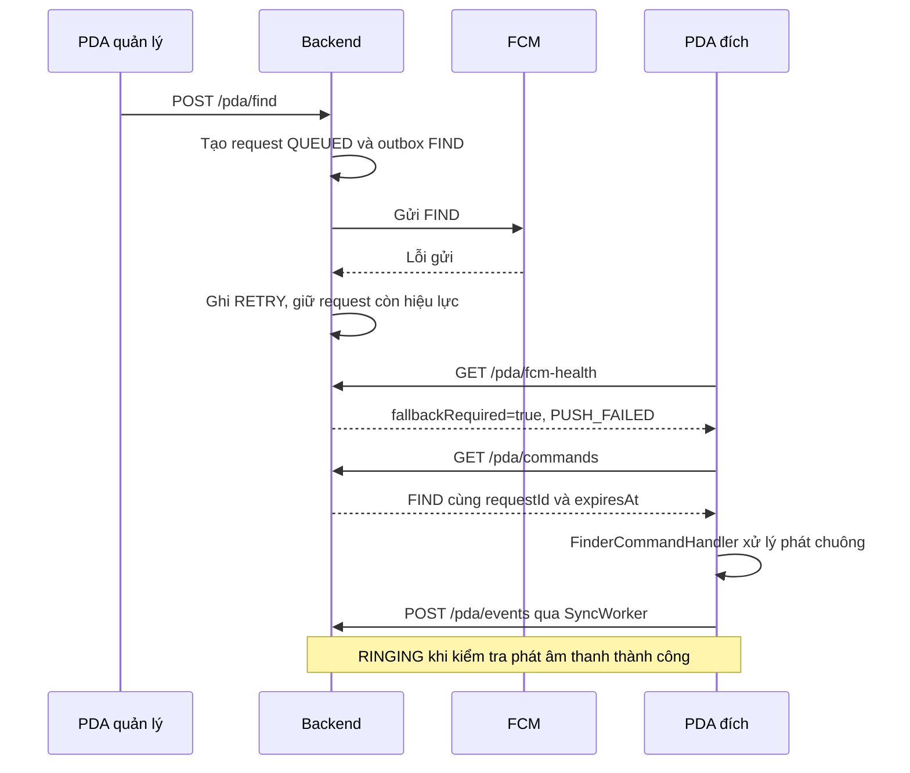

# Cách hệ thống chuyển từ FCM sang polling

Tài liệu giải thích code hiện tại của chức năng tìm PDA, đối chiếu ngày 2026-09-29. Hướng dẫn cấu hình và kiểm thử triển khai nằm trong [15-finder-polling.md](15-finder-polling.md).

## 1. Cơ chế đang dùng

FCM là đường nhận lệnh push. Khi PDA hoặc backend ghi nhận lỗi FCM, PDA bắt đầu lấy lệnh FIND/STOP qua HTTP. Khi cả hai phía không còn lỗi, PDA ngừng lấy lệnh qua HTTP.

Hệ thống phân biệt hai loại request:

| API | Mục đích | Khi nào gọi? |
| --- | --- | --- |
| `GET /pda/fcm-health` | Hỏi backend có ghi nhận lỗi FCM của PDA này không | Định kỳ khoảng 15 giây khi service chạy |
| `GET /pda/commands` | Lấy các lệnh FIND/STOP còn hiệu lực | Chỉ khi có lỗi FCM; chờ 5 giây sau lượt thành công |

**FCM tốt thì không polling lệnh, nhưng vẫn kiểm tra trạng thái qua HTTP.** PDA cần đường kiểm tra này để biết lỗi gửi phát sinh ở backend. API health đọc cấu hình/token/kết quả gửi đã lưu; nó không gửi một message thử tới Firebase.

Foreground service giám sát vẫn chạy trong cả hai chế độ. “Dừng polling” trong tài liệu này nghĩa là dừng gọi `/pda/commands`, không phải dừng service hoặc bỏ mọi request HTTP.

## 2. Điều kiện quyết định

Trong [FinderPollingCycle.java](../pda-android/app/src/main/java/com/company/pda/infrastructure/firebase/FinderPollingCycle.java), `run()` kiểm tra:

```java
if (!localFcmFailed && !backendFailed) {
  delaySeconds = 15;
  return List.of();
}
delaySeconds = 5;
return transport.commands();
```

Hai biến mang ý nghĩa:

- `localFcmFailed`: trạng thái do `FcmTokenManager.unavailable()` trên PDA cung cấp.
- `backendFailed`: giá trị `fallbackRequired` từ lần kiểm tra health thành công gần nhất, được giữ trong vòng giám sát hiện tại.

| Lỗi tại PDA | Lỗi tại backend | Có lấy lệnh bằng HTTP? |
| --- | --- | --- |
| Không | Không | Không |
| Có | Không | Có |
| Không | Có | Có |
| Có | Có | Có |



Sơ đồ mô tả lượt xử lý thành công. Cách xử lý lỗi HTTP được giải thích ở mục 8.

## 3. PDA nhận biết lỗi FCM như thế nào?

[FcmTokenManager.java](../pda-android/app/src/main/java/com/company/pda/infrastructure/firebase/FcmTokenManager.java) kiểm tra:

```java
public boolean unavailable() {
  return tokens.get("fcmToken") == null
      || tokens.get("fcmFailure") != null;
}
```

| Tình huống | Trạng thái lưu tại PDA |
| --- | --- |
| Chưa có Firebase app được khởi tạo khi gọi `initialize()` | `fcmFailure = NOT_CONFIGURED` |
| `FirebaseMessaging.getToken()` trả về task thất bại | `fcmFailure = TOKEN_ERROR` |
| Chưa có `fcmToken` trong storage | `unavailable()` trả về `true`, kể cả chưa có mã lỗi |
| Nhận FIND qua FCM nhưng priority thực nhận không phải HIGH | `fcmFailure = DELIVERY_ERROR` |

Trường hợp priority được ghi nhận trong [PdaFirebaseMessagingService.java](../pda-android/app/src/main/java/com/company/pda/infrastructure/firebase/PdaFirebaseMessagingService.java), sau khi kiểm tra request ID là UUID và command là FIND hoặc STOP. STOP không cần khởi động phát chuông nên STOP priority thấp không tự tạo lỗi delivery.

Lỗi khởi động alarm do Android, lỗi loa hoặc DND không tự được phân loại là lỗi FCM. Vì vậy, các lỗi này không tự bật polling nếu cả hai phía vẫn báo FCM không lỗi.

## 4. Backend nhận biết lỗi FCM như thế nào?

[OutboxProcessor.java](../pda-management/src/main/java/com/company/pda/application/pdafinder/service/OutboxProcessor.java) gửi lệnh qua FCM và ghi kết quả vào `pda_alert_logs`:

| Kết quả gửi | Event |
| --- | --- |
| Không có token | `NO_TOKEN` |
| Token bị gateway xác định không còn hợp lệ | `INVALID_TOKEN`; đồng thời vô hiệu hóa token tương ứng |
| Lời gọi gửi ném lỗi runtime | `RETRY` |
| Gửi FIND thành công | `PUSH_FIND` |
| Gửi STOP thành công | `PUSH_STOP` |

`PdaFinderService.fcmHealth()` xét theo thứ tự:

1. Xác thực device ID và device secret.
2. Nếu backend tắt FCM: trả `fallbackRequired=true`, reason `FCM_DISABLED`.
3. Nếu thiết bị không có token trên backend: trả `true`, reason `NO_TOKEN`.
4. Đọc event gửi push gần nhất của đúng thiết bị/cửa hàng. Nếu là `RETRY`, `INVALID_TOKEN` hoặc `NO_TOKEN`: trả `true`, reason `PUSH_FAILED`.
5. Các trường hợp còn lại: trả `false`, reason `READY`.

“Gần nhất” ở đây là event có `id` lớn nhất trong nhóm event gửi push nêu trên, theo [PdaFindMapper.xml](../pda-management/src/main/resources/mapper/PdaFindMapper.xml). Event nghiệp vụ như RINGING, STOPPED hoặc FAILED không được dùng để kết luận FCM đã phục hồi. Không có lịch sử gửi cũng có thể trả READY nếu FCM bật và thiết bị có token.

Ví dụ response:

```json
{
  "fallbackRequired": true,
  "reason": "PUSH_FAILED"
}
```

Nguồn xử lý: [PdaFinderService.java](../pda-management/src/main/java/com/company/pda/application/pdafinder/service/PdaFinderService.java).

## 5. Một lần fallback từ đầu tới cuối

Ví dụ: backend có token, FCM được bật, nhưng gửi FIND thất bại.



Không cần tạo một request tìm PDA mới để dùng polling. Backend giữ request cũ và cung cấp cùng `requestId` qua HTTP. Lỗi token hoặc hết lượt retry push không tự chuyển request thành FAILED; request vẫn có thể được nhận qua polling tới hạn. Scheduler xử lý EXPIRED nếu request còn hoạt động khi hết hạn.

Fallback không vô hiệu hóa đường FCM hoặc hủy mọi retry push. Trong giai đoạn lỗi, FCM có thể gửi lại thành công trong lúc PDA đang polling; handler chung xử lý việc nhận trùng.

## 6. Polling lấy và xử lý lệnh gì?

`GET /pda/commands` xác thực thiết bị và chỉ trả request thuộc thiết bị/cửa hàng đó với `expires_at > now()`:

| Trạng thái request | Command trả cho PDA |
| --- | --- |
| QUEUED, SENT, RINGING | FIND |
| STOPPED, FAILED, EXPIRED nếu thời hạn vẫn còn theo truy vấn | STOP |

Trong luồng hết hạn thông thường, EXPIRED đã quá `expiresAt` nên không được trả; alarm trên PDA cũng có thời hạn dừng riêng.

```json
[
  {
    "requestId": "12345678-1234-1234-1234-123456789012",
    "command": "FIND",
    "expiresAt": "2026-09-29T08:00:00Z"
  }
]
```

Thời điểm trên chỉ là ví dụ định dạng. Lệnh thực tế phải còn hiệu lực khi PDA xử lý.

[FinderCommandHandler.java](../pda-android/app/src/main/java/com/company/pda/infrastructure/firebase/FinderCommandHandler.java) nhận lệnh từ cả FCM lẫn polling:

- Bỏ request ID sai định dạng và FIND có thời hạn sai hoặc đã hết hạn.
- Bỏ FIND đã có dấu `handled:<requestId>` hoặc đang phát chuông với cùng ID.
- STOP ghi dấu đã xử lý để FIND đến trễ không khởi động lại chuông.
- Alarm service kiểm tra lại thời hạn/dấu đã xử lý khi nhận intent khởi động.

GET không xóa lệnh. Việc nhận lặp lại giúp tránh mất lệnh khi response bị mất; dấu đã xử lý ngăn phát chuông lại. Trạng thái thực thi được đưa vào hàng chờ bởi [SyncWorker.java](../pda-android/app/src/main/java/com/company/pda/infrastructure/firebase/SyncWorker.java).

## 7. Khi nào trở lại FCM?

PDA chỉ ngừng polling lệnh khi **cả `localFcmFailed` và `backendFailed` đều là false**.

| Phía | Tín hiệu phục hồi hiện tại |
| --- | --- |
| PDA: lỗi token | `refreshed(token)` lưu token và xóa mã lỗi nếu mã hiện tại không phải DELIVERY_ERROR |
| PDA: lỗi delivery | Nhận lại FIND/STOP hợp lệ qua FCM với priority HIGH gọi `received()` để xóa mã lỗi |
| Backend: lỗi gửi | Một lần gửi push về sau thành công tạo PUSH_FIND/PUSH_STOP; lần kiểm tra health tiếp theo trả READY nếu FCM bật và token còn tồn tại |

Service thử lại việc lấy token mỗi khoảng 60 giây nếu mã lỗi hiện tại là TOKEN_ERROR. Lấy được token không xóa DELIVERY_ERROR, vì có token chưa chứng minh khả năng nhận message đã phục hồi. Sau `received()`, nếu token vẫn thiếu thì `unavailable()` vẫn trả true.

Backend không tự xóa lỗi gửi chỉ vì đã chờ đủ lâu. Nếu chưa có lần gửi mới thành công, lỗi gần nhất có thể tiếp tục giữ polling hoạt động. Sự kiện RINGING đến qua HTTP cũng không phải bằng chứng FCM phục hồi.

## 8. Nếu HTTP cũng lỗi thì sao?

- Lỗi mạng/HTTP kiểm tra health không tự được coi là lỗi FCM. Nếu trước đó không có lỗi FCM được biết, hệ thống không tự bật polling lệnh chỉ vì health không truy cập được.
- Nếu PDA hoặc backend đã có lỗi FCM được biết, lỗi kiểm tra health thông thường không xóa trạng thái đó; vòng xử lý vẫn có thể thử lấy lệnh.
- HTTP 401/403 từ health hoặc commands làm service dừng, tránh tiếp tục gọi bằng credential không được chấp nhận.
- Các lỗi HTTP khác được service xử lý bằng cách tăng gấp đôi khoảng chờ hiện tại, tối đa 60 giây. Lượt thành công đặt lại nhịp theo chế độ: 15 giây khi chỉ giám sát hoặc 5 giây khi lấy lệnh.

Các con số 5/15/60 giây là nhịp lập lịch, không phải cam kết độ trễ nhận lệnh. HTTP có timeout 30 giây; thời gian request, backoff và việc Android trì hoãn thực thi đều ảnh hưởng thời điểm gọi tiếp.

## 9. Khởi động, xác thực và chạy nền

[HomeActivity.java](../pda-android/app/src/main/java/com/company/pda/presentation/home/HomeActivity.java) gọi `FinderPollingService.start()` khi resume. Callback đăng ký thiết bị thành công trong [HomeViewModel.java](../pda-android/app/src/main/java/com/company/pda/presentation/home/HomeViewModel.java) cũng gọi phương thức này. Service yêu cầu PDA đã có device ID và device secret.

Cả hai API dùng:

```http
X-Device-Id: <deviceId>
X-Device-Secret: <deviceSecret>
```

Credential độc lập với phiên đăng nhập của nhân viên. Backend xác định cửa hàng từ thiết bị đã xác thực; client không tự chọn cửa hàng. Response health/commands dùng `Cache-Control: no-store`.

[FinderPollingService.java](../pda-android/app/src/main/java/com/company/pda/infrastructure/firebase/FinderPollingService.java) chạy foreground với thông báo thường trực, type `specialUse` và partial wake lock có lease 10 phút được gia hạn. Service dùng một executor, hủy HTTP đang chạy và giải phóng wake lock khi bị hủy. Khi credential đổi, vòng theo dõi được tạo lại để không dùng trạng thái backend của thiết bị cũ.

Để chạy khi khóa màn hình trên PDA được quản lý, cần cấu hình chính sách pin/chạy nền phù hợp như [hướng dẫn triển khai polling](15-finder-polling.md). START_STICKY không bảo đảm luôn sống; sau force-stop hoặc reboot, luồng hiện tại cần mở lại Home, không có tự khởi động từ boot receiver.

## 10. Những trường hợp không được tự phát hiện

- **FCM chấp nhận gửi nhưng không giao message tới PDA:** backend có thể báo READY, còn PDA không có callback lỗi để ghi nhận. Hệ thống hiện không dùng timeout thiếu ACK hoặc heartbeat push để phát hiện trường hợp này.
- **Lâu không có message FCM:** không bị coi là lỗi; có thể đơn giản là không ai yêu cầu tìm máy.
- **Android chặn alarm hoặc loa phát thất bại:** không tự biến thành lỗi FCM để kích hoạt polling.
- **Mất mạng hoàn toàn:** cả FCM lẫn HTTP đều có thể không dùng được. Polling không làm lệnh đã hết hạn trở nên hợp lệ lại.

`FCM_ENABLED=false` trên backend được coi là kênh FCM không khả dụng, nên polling lệnh luôn bật sau khi nhận trạng thái đó. Muốn quan sát chế độ FCM bình thường cần bật FCM, có cấu hình/token hợp lệ và không còn lỗi FCM ở hai phía.

## 11. Vị trí đọc code và kiểm thử

| Nội dung | File |
| --- | --- |
| Điều kiện bật/tắt và nhịp kiểm tra | [FinderPollingCycle](../pda-android/app/src/main/java/com/company/pda/infrastructure/firebase/FinderPollingCycle.java) |
| Lập lịch, gọi HTTP, backoff, vòng đời service | [FinderPollingService](../pda-android/app/src/main/java/com/company/pda/infrastructure/firebase/FinderPollingService.java) |
| Theo dõi lỗi/token tại PDA | [FcmTokenManager](../pda-android/app/src/main/java/com/company/pda/infrastructure/firebase/FcmTokenManager.java) |
| Nhận FCM, đánh dấu delivery lỗi/phục hồi | [PdaFirebaseMessagingService](../pda-android/app/src/main/java/com/company/pda/infrastructure/firebase/PdaFirebaseMessagingService.java) |
| Xác định trạng thái FCM và trả lệnh | [PdaFinderService](../pda-management/src/main/java/com/company/pda/application/pdafinder/service/PdaFinderService.java) |
| Lưu kết quả gửi push | [OutboxProcessor](../pda-management/src/main/java/com/company/pda/application/pdafinder/service/OutboxProcessor.java) |
| Truy vấn event gửi gần nhất và lệnh còn hạn | [PdaFindMapper.xml](../pda-management/src/main/resources/mapper/PdaFindMapper.xml) |
| Test không lấy lệnh khi FCM tốt, chuyển chế độ và lỗi HTTP | [FinderPollingCycleTest](../pda-android/app/src/test/java/com/company/pda/infrastructure/firebase/FinderPollingCycleTest.java) |
| Test xác định lỗi/phục hồi phía backend | [FcmHealthTest](../pda-management/src/test/java/com/company/pda/application/pdafinder/FcmHealthTest.java) |
| Test API, SQL và cách ly thiết bị | [StoreFlowsIT](../pda-management/src/test/java/com/company/pda/presentation/StoreFlowsIT.java) |
| Test trạng thái token/delivery và service trên Android | [FinderCommandTest](../pda-android/app/src/androidTest/java/com/company/pda/FinderCommandTest.java) |
