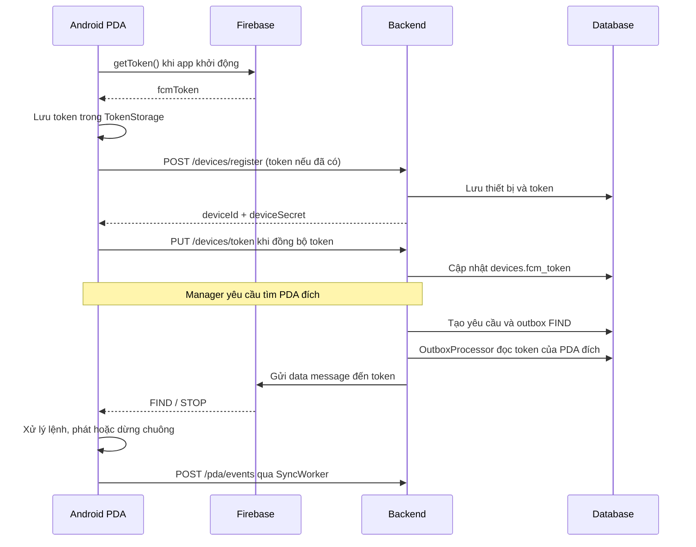

# Quy trình lấy fcmToken trên Android và sử dụng ở backend

Tài liệu mô tả code hiện tại của dự án PDA, đối chiếu ngày 2026-09-29. Các giá trị token, credential và ID trong ví dụ chỉ là placeholder.

## 1. Các thành phần cần phân biệt

| Giá trị | Nguồn cấp | Mục đích |
| --- | --- | --- |
| `fcmToken` | Firebase SDK lấy từ dịch vụ Firebase | Backend chỉ định app đích khi gửi push |
| `deviceId` | Backend khi đăng ký PDA | Xác định bản ghi thiết bị trong hệ thống |
| `deviceSecret` | Backend khi đăng ký PDA | Xác thực các API dành cho thiết bị |
| Access token/JWT | Backend khi đăng nhập | Xác thực nhân viên/quản lý khi đăng ký PDA; website tìm/dừng không có JWT |

`fcmToken` có thể thay đổi. Backend lưu giá trị hiện tại trong bản ghi thiết bị và dùng nó làm địa chỉ gửi push. Token này không thay thế JWT hoặc `deviceSecret`.

## 2. Sơ đồ tổng thể



Sơ đồ minh họa trường hợp token có trước đăng ký. Nếu đăng ký trước khi lấy được token, Android gửi `fcmToken = null`, rồi cập nhật token sau bằng `PUT /devices/token`.

## 3. Điều kiện cấu hình trong dự án

### Android

- Cấu hình Firebase client cho application ID `com.company.pda`, đặt `google-services.json` trong `pda-android/app/`.
- File build app chỉ áp dụng Google Services plugin khi file cấu hình này tồn tại.
- PDA hoặc emulator cần hỗ trợ Google Play services cho luồng FCM đang dùng và kết nối được Firebase khi đăng ký token.
- App cần truy cập được backend để đăng ký thiết bị và đồng bộ token.

### Backend

- Bật `FCM_ENABLED=true`, tương ứng `app.fcm-enabled`.
- Cung cấp Application Default Credentials có quyền gửi tới Firebase project của app. Với môi trường local, cách cấu hình credential được mô tả trong tài liệu triển khai.
- Bật `app.scheduler-enabled=true` để scheduler xử lý outbox; profile dev hiện mặc định bật, có thể ghi đè bằng `APP_SCHEDULER_ENABLED`.

Android có thể lấy token dù backend chưa bật gửi FCM. Backend cũng có thể lưu token khi FCM bị tắt; hai bước này độc lập với việc gửi push.

Xem [hướng dẫn triển khai](11-deployment.md), [build app](../pda-android/app/build.gradle), [FirebaseConfig](../pda-management/src/main/java/com/company/pda/infrastructure/firebase/FirebaseConfig.java) và [profile dev](../pda-management/src/main/resources/application-dev.yml).

## 4. Android lấy token lúc nào?

### Bước 1: App khởi động

[PdaApplication.onCreate()](../pda-android/app/src/main/java/com/company/pda/PdaApplication.java) gọi:

```java
modules.fcm.initialize();
```

Lệnh này chạy khi tiến trình app khởi tạo, trước khi cần đăng nhập. Việc lấy token là bất đồng bộ: gọi `initialize()` không có nghĩa token đã có ngay.

### Bước 2: Gọi Firebase SDK

[FcmTokenManager.initialize()](../pda-android/app/src/main/java/com/company/pda/infrastructure/firebase/FcmTokenManager.java) thực hiện:

```java
if (com.google.firebase.FirebaseApp.getApps(context).isEmpty()) {
  failed("NOT_CONFIGURED");
} else {
  com.google.firebase.messaging.FirebaseMessaging.getInstance()
      .getToken()
      .addOnSuccessListener(this::refreshed)
      .addOnFailureListener(error -> failed("TOKEN_ERROR"));
}
SyncWorker.schedule(context);
```

- Chưa có FirebaseApp: ghi lỗi `NOT_CONFIGURED`.
- Lấy token thất bại: ghi lỗi `TOKEN_ERROR`.
- Thành công: gọi `refreshed(token)` để lưu và lên lịch đồng bộ.
- Gọi lấy token không đồng nghĩa mỗi lần mở app đều tạo một token khác.

### Bước 3: Lưu token trên thiết bị

```java
public void refreshed(String token) {
  tokens.put("fcmToken", token);
  if (!"DELIVERY_ERROR".equals(tokens.get("fcmFailure")))
    tokens.put("fcmFailure", null);
  SyncWorker.schedule(context);
}
```

[TokenStorage](../pda-android/app/src/main/java/com/company/pda/data/local/preferences/TokenStorage.java) lưu giá trị mã hóa AES/GCM trong SharedPreferences `secure`, dùng khóa trong Android Keystore.

Việc lấy được token xóa các lỗi token/cấu hình trước đó, nhưng giữ `DELIVERY_ERROR`: có token chưa chứng minh luồng nhận lệnh đã phục hồi.

### Bước 4: Nhận token mới khi Firebase thông báo

[PdaFirebaseMessagingService](../pda-android/app/src/main/java/com/company/pda/infrastructure/firebase/PdaFirebaseMessagingService.java) cũng chuyển token về cùng hàm lưu:

```java
public void onNewToken(String token) {
  ((PdaApplication) getApplication()).modules().fcm.refreshed(token);
}
```

Vì vậy cả kết quả `getToken()` và callback `onNewToken()` đều dẫn đến lưu token rồi lên lịch đồng bộ backend.

## 5. Hai đường gửi token lên backend

### Đường A: Gửi kèm đăng ký PDA

[HomeActivity.register()](../pda-android/app/src/main/java/com/company/pda/presentation/home/HomeActivity.java) gọi API trực tiếp trong công việc nền của `ScreenTasks.run()`. Đoạn gửi request đọc token đang có:

```java
String token = modules.tokens.get("fcmToken");
var r = execute(modules.finderApi.register(new PdaFinderDto.Register(code, name, token)));
modules.device.registered(r.deviceId, r.deviceSecret);
```

Request minh họa:

```http
POST /devices/register
Authorization: Bearer <employee-or-manager-access-token>
Content-Type: application/json

{
  "deviceCode": "PDA-001",
  "deviceName": "PDA kho A",
  "fcmToken": "<fcm-token-hoac-null>"
}
```

Nếu chưa có token, giá trị là JSON `null` hoặc trường bị bỏ qua khi serialize; không gửi chuỗi `"null"`. API đăng ký yêu cầu role `MANAGER` hoặc `EMPLOYEE`. Home mở form sau login nếu máy chưa đăng ký. Backend lưu thiết bị, token nếu có, và trả về `deviceId`, `deviceSecret` để Android lưu.

Sau đăng ký thành công, [HomeActivity.register()](../pda-android/app/src/main/java/com/company/pda/presentation/home/HomeActivity.java) gọi lại `modules.fcm.initialize()` và chỉ khởi động polling nếu APK được cấu hình `finderTransport=polling`.

### Đường B: Đồng bộ token bằng SyncWorker

[SyncWorker](../pda-android/app/src/main/java/com/company/pda/infrastructure/firebase/SyncWorker.java) đọc ba giá trị:

```java
String id = m.tokens.get("deviceId"),
    secret = m.tokens.get("deviceSecret"),
    token = m.tokens.get("fcmToken");
if (id == null || secret == null) return Result.success();
if (token != null)
  execute(m.finderApi.token(
      Long.parseLong(id), secret, new PdaFinderDto.Token(token)));
```

Request tương ứng trong [PdaFinderApi](../pda-android/app/src/main/java/com/company/pda/data/remote/api/PdaFinderApi.java):

```http
PUT /devices/token
X-Device-Id: 123
X-Device-Secret: <device-secret>
Content-Type: application/json

{"fcmToken": "<fcm-token-moi-nhat>"}
```

Worker chỉ chạy khi có mạng theo constraint của WorkManager. Nếu chưa có thông tin đăng ký thiết bị, worker kết thúc thành công và không gửi token; lần đăng ký thành công sẽ lên lịch lại qua `initialize()`.

Lỗi API 401/403 khiến worker thất bại, các lỗi API khác hoặc exception dẫn đến retry với exponential backoff bắt đầu từ 30 giây. Đây là chính sách thử lại, không bảo đảm đúng 30 giây sẽ có lần chạy tiếp theo. Worker còn gửi các sự kiện đang chờ nên có thể gửi lại cùng token ở những lần đồng bộ sau.

## 6. Backend nhận, xác thực và lưu token

Luồng gọi:

```text
DeviceController.token()
  → DeviceService.token()
  → authenticate(deviceId, deviceSecret)
  → DeviceRepository.token()
  → UPDATE devices
```

[DeviceController](../pda-management/src/main/java/com/company/pda/presentation/rest/device/DeviceController.java) nhận header và body. [DeviceService](../pda-management/src/main/java/com/company/pda/application/device/service/DeviceService.java) kiểm tra secret bằng cách so sánh hash với credential đã lưu, sau đó cập nhật token và ghi audit `DEVICE_TOKEN_REFRESH`.

Endpoint `/devices/token` được phép đi qua tầng kiểm tra JWT, nhưng vẫn xác thực credential thiết bị trong service. [SecurityConfig](../pda-management/src/main/java/com/company/pda/infrastructure/security/SecurityConfig.java).

[DeviceMapper.xml](../pda-management/src/main/resources/mapper/DeviceMapper.xml) thực hiện:

```sql
UPDATE devices
SET fcm_token = #{token}, last_active_at = now(), updated_at = now()
WHERE id = #{id}
```

Token nằm ở `devices.fcm_token`; schema có unique index cho token khác NULL. Trường update phải khác rỗng và dài tối đa 4096 ký tự. Bước lưu chỉ kiểm tra request/credential, không thử gửi tới Firebase để chứng minh token hoạt động.

## 7. Backend dùng token để gửi FIND/STOP

### Bước 1: Website React tạo yêu cầu tìm PDA

```http
POST /web/finder/devices/123/find
```

[PdaFinderService.findFromWeb()](../pda-management/src/main/java/com/company/pda/application/pdafinder/service/PdaFinderService.java) lấy cửa hàng từ PDA trong database, tạo request có hạn dùng và đưa sự kiện `FIND` vào outbox trong transaction. Web không yêu cầu login; request/audit không có actor người dùng. Yêu cầu vẫn được tạo khi chưa có token để PDA đã chọn cấu hình `finderTransport=polling` có thể nhận qua HTTP; bản FCM không tự chuyển chế độ.

Lệnh dừng đi qua `POST /web/finder/requests/{id}/stop` không có JWT/body, cập nhật trạng thái và đưa `STOP` vào outbox khi cập nhật có hiệu lực.

### Bước 2: Xử lý outbox

[OutboxScheduler](../pda-management/src/main/java/com/company/pda/infrastructure/firebase/OutboxScheduler.java) gọi processor theo lịch khi scheduler được bật.

[OutboxProcessor.processOne()](../pda-management/src/main/java/com/company/pda/application/pdafinder/service/OutboxProcessor.java) đọc request và bản ghi PDA đích, sau đó gọi:

```java
push.send(device.fcmToken(), event.eventType(), request.id(), request.expiresAt());
```

Token được đọc tại lúc xử lý outbox; payload outbox chứa thông tin cửa hàng để tìm request, không chụp cố định token tại lúc người dùng website nhấn Tìm. Token dùng là của PDA đích, không phải của trình duyệt web.

### Bước 3: Firebase Admin SDK gửi data message

[FirebaseNotificationAdapter](../pda-management/src/main/java/com/company/pda/infrastructure/firebase/FirebaseNotificationAdapter.java) dựng message:

```java
Message.builder()
    .setToken(token)
    .putData("command", command)
    .putData("requestId", id.toString())
    .putData("expiresAt", expiresAt.toString())
    .setAndroidConfig(
        AndroidConfig.builder()
            .setPriority(AndroidConfig.Priority.HIGH)
            .setTtl(ttl)
            .build())
    .build();
```

Adapter gọi `messaging.send(...)`. TTL tính theo thời gian còn lại đến `expiresAt`, tối thiểu bằng 0. Message gồm data `command`, `requestId`, `expiresAt`; chính Android xử lý dữ liệu này để điều khiển chuông.

Gửi thành công: processor ghi `PUSH_FIND` hoặc `PUSH_STOP`; với FIND còn gọi cập nhật trạng thái `SENT`.

## 8. Android nhận lệnh và xác nhận kết quả

`PdaFirebaseMessagingService.onMessageReceived()` chỉ xử lý khi `BuildConfig.FINDER_TRANSPORT` là `fcm` (mặc định); bản `polling` bỏ qua message. Receiver kiểm tra UUID và loại lệnh FIND/STOP, cập nhật trạng thái FCM rồi chuyển xử lý lên main thread qua [FinderCommandHandler](../pda-android/app/src/main/java/com/company/pda/infrastructure/firebase/FinderCommandHandler.java).

- FIND kiểm tra hạn dùng, request đã xử lý hoặc đang phát chuông để tránh lặp.
- Với FCM, chỉ message có priority HIGH được cho phép thử bật chuông trực tiếp; FIND không HIGH hiển thị thông báo fallback và ghi `DELIVERY_ERROR`.
- STOP gọi use case dừng chuông.
- Push HIGH có ID/loại lệnh hợp lệ xóa cờ lỗi FCM local.

[PdaAlarmService](../pda-android/app/src/main/java/com/company/pda/infrastructure/alarm/PdaAlarmService.java) ghi sự kiện như `RINGING`, `STOPPED`, `FAILED` qua `SyncWorker.event()`. Worker gửi các sự kiện này tới `POST /pda/events` với credential thiết bị. Backend kiểm tra request thuộc đúng PDA trước khi cập nhật trạng thái.

Phải phân biệt: token đã lưu, gửi push thành công và PDA đã phát chuông là ba mốc khác nhau. `SENT` không phải xác nhận `RINGING`.

## 9. Token lỗi và liên hệ với polling

| Tình huống | Hành vi hiện tại |
| --- | --- |
| Android chưa cấu hình Firebase | Ghi lỗi local `NOT_CONFIGURED` |
| Android lấy token lỗi | Ghi `TOKEN_ERROR`; thử lại khi Home resume, ngoài lần initialize khi app khởi động |
| Backend không có token | Outbox ghi `NO_TOKEN`, kết thúc sự kiện outbox; request vẫn có thể được lấy qua polling |
| Firebase trả `UNREGISTERED` | Adapter chuyển thành `InvalidToken`; processor xóa token tương ứng và ghi `INVALID_TOKEN` |
| Gửi push gặp lỗi khác hoặc FCM bị tắt | Ghi `RETRY`, thử lại outbox có giới hạn; hết lượt không tự đóng đường nhận lệnh HTTP |
| Token mới được SDK trả về | Android lưu và lên lịch đồng bộ lại backend |

Khi vô hiệu hóa token, SQL dùng cả ID và token đã gửi thất bại:

```sql
UPDATE devices SET fcm_token = NULL, updated_at = now()
WHERE id = #{id} AND fcm_token = #{token}
```

Điều kiện này tránh xóa nhầm token mới nếu một cập nhật token khác đã xảy ra.

`GET /pda/fcm-health` vẫn báo `fallbackRequired` khi FCM bị tắt, backend thiếu token hoặc sự kiện push gần nhất cho thấy lỗi, để chẩn đoán/tương thích client cũ. Android hiện tại không gọi health định kỳ và không tự chuyển transport. Mặc định `finderTransport=fcm`; chỉ APK build với `finderTransport=polling` lấy lệnh HTTP mỗi 5 giây, bất kể tình trạng FCM. Lỗi token không tự bật polling.

Các giới hạn cần hiểu khi debug code hiện tại:

- Backend xóa token không trực tiếp xóa token đang lưu trên Android. Không có lệnh `deleteToken()` trong luồng này để cưỡng bức tạo token mới; worker có thể gửi lại token local nếu SDK chưa cập nhật.
- Cập nhật token không tự xóa log lỗi push gần nhất. Health có thể tiếp tục báo lỗi cho đến khi có sự kiện push mới phù hợp.
- Không có token mới không đồng nghĩa FCM lỗi; một token có thể tiếp tục được dùng qua nhiều lần mở app.
- FCM chấp nhận gửi nhưng thiết bị không nhận được âm thầm chưa chắc được health hiện tại phát hiện.

Xem cách build/cài APK đổi chế độ tại [cấu hình FCM hoặc polling](16-fcm-to-polling-fallback.md).

## 10. Cách kiểm tra luồng khi phát triển

1. Cấu hình Firebase client/backend và bật scheduler theo mục 3.
2. Đặt breakpoint ở `FcmTokenManager.refreshed()`; mở app, kiểm tra có token và token đã lưu. Có thể kiểm tra bước này trước đăng nhập.
3. Đăng nhập nhân viên/quản lý và hoàn thành form đăng ký PDA tại Home. Kiểm tra nhận `deviceId`, `deviceSecret`.
4. Theo dõi request đăng ký hoặc `PUT /devices/token`; kiểm tra backend lưu `devices.fcm_token` và audit đồng bộ khi đi qua API cập nhật.
5. Từ website React, tạo yêu cầu tìm đúng PDA đã đăng ký; theo dõi request, outbox và log `PUSH_FIND`/lỗi tương ứng.
6. Dùng APK `finderTransport=fcm`, đặt breakpoint sau kiểm tra transport trong `onMessageReceived()` để xác nhận lệnh đến qua FCM. APK `polling` bỏ qua message FCM.
7. Kiểm tra sự kiện `RINGING` gửi về backend, sau đó thử STOP và kiểm tra chuông dừng.

Có thể kiểm tra token đã có trong database mà không in toàn bộ giá trị:

```sql
SELECT id, device_code, (fcm_token IS NOT NULL) AS has_fcm_token,
       last_active_at, updated_at
FROM devices
WHERE id = 123;
```

Tài liệu này mô tả luồng đang triển khai và hướng dẫn kiểm tra; không thay đổi code hay khẳng định đã chạy thử FCM thực tế.
