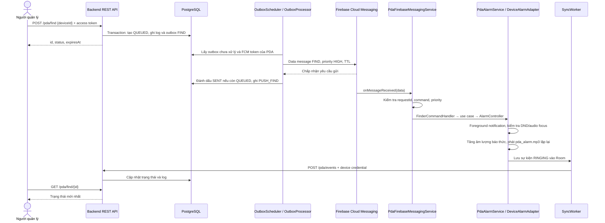

# 20. Hướng dẫn FCM kích hoạt âm thanh tìm PDA — backend và Android

Tài liệu đối chiếu code trong repository ngày 03/10/2026. Backend dùng Java 8 / Spring Boot 2.7.0; source Android dùng Java 17 và Gradle JDK 21. Các đoạn code dưới đây là trích đoạn từ dự án, có thể lược bỏ import và phần không liên quan; mở liên kết nguồn để xem class đầy đủ.

**FCM chuyển lệnh tới PDA. Chính app Android mở foreground service và phát âm thanh có sẵn trong APK.** Backend không truyền file nhạc và FCM không trực tiếp điều khiển loa.

## 1. Luồng tổng thể



Đây là luồng thành công. Việc giao FCM và ghi `SENT` có thể chạy đan xen; backend chỉ đổi sang `SENT` nếu trạng thái vẫn là `QUEUED`, nên không ghi đè `RINGING` đã nhận sớm.

| Dữ liệu | Vai trò |
| --- | --- |
| `deviceId` | ID của thiết bị trong database backend |
| `fcmToken` | Địa chỉ gửi FCM tới một bản cài app; có thể thay đổi |
| `deviceSecret` | Credential cho PDA gọi API token, sự kiện và polling |
| Access token người dùng | Xác thực người quản lý khi đăng ký/tìm/dừng PDA |
| `requestId` | UUID của một lần tìm; dùng chống lặp và ghép sự kiện |
| `expiresAt` | Thời hạn tuyệt đối của lần tìm, chuỗi thời gian UTC |

FCM token không thay thế device secret hoặc access token. Các loại token này không được dùng lẫn nhau.

## 2. Cấu hình để chạy FCM thật

### 2.1. Android

1. Trong Firebase project, đăng ký Android app với package **`com.company.pda`**.
2. Đặt cấu hình client tại `pda-android/app/google-services.json`, rồi Gradle Sync và cài lại APK.
3. Emulator dùng image có Google Play services; PDA cần môi trường hỗ trợ Firebase Messaging và kết nối mạng.
4. Mở app, cấp quyền thông báo, đăng nhập manager và **Register this PDA**.
5. Kiểm tra **Finder sound settings** trước khi thử gửi lệnh.

[app/build.gradle](../pda-android/app/build.gradle) hiện có:

```groovy
if (file('google-services.json').exists()) {
    apply plugin: 'com.google.gms.google-services'
}
// Trong dependencies:
implementation platform('com.google.firebase:firebase-bom:33.10.0')
implementation 'com.google.firebase:firebase-messaging'
```

Nếu thiếu file client, app vẫn build được nhưng không có cấu hình Firebase mặc định; luồng hiện tại ghi nhận `NOT_CONFIGURED` và có thể dùng polling.

[AndroidManifest.xml](../pda-android/app/src/main/AndroidManifest.xml) đăng ký receiver và service phát chuông:

```xml
<service
    android:name=".infrastructure.firebase.PdaFirebaseMessagingService"
    android:exported="false">
    <intent-filter>
        <action android:name="com.google.firebase.MESSAGING_EVENT" />
    </intent-filter>
</service>

<service
    android:name=".infrastructure.alarm.PdaAlarmService"
    android:exported="false"
    android:foregroundServiceType="mediaPlayback" />
```

Manifest cũng khai báo `INTERNET`, `POST_NOTIFICATIONS`, `FOREGROUND_SERVICE`, `FOREGROUND_SERVICE_MEDIA_PLAYBACK`, `MODIFY_AUDIO_SETTINGS`, `ACCESS_NOTIFICATION_POLICY` và `WAKE_LOCK`. Khai báo DND access trong manifest không tự cấp quyền: người dùng phải bật trong Settings.

### 2.2. Backend

Firebase Admin phải có credential của project phù hợp với Android. Giữ service account JSON ở phía backend, không đưa vào APK. `google-services.json` của Android không phải credential Firebase Admin.

Ví dụ PowerShell từ thư mục gốc workspace, thay đường dẫn credential bằng file thật:

```powershell
$env:GOOGLE_APPLICATION_CREDENTIALS = 'C:\credentials\firebase-admin.json'
& 'C:\Program Files\Java\jdk1.8.0_202\bin\java.exe' `
  -jar '.\pda-management\target\pda-management-1.0.0.war' `
  --spring.profiles.active=dev `
  --app.fcm-enabled=true `
  --app.scheduler-enabled=true
```

Backend và PostgreSQL phải khởi động được trước. Profile `dev` trong repository tắt scheduler mặc định, nên tham số bật scheduler rất quan trọng khi thử push. Có thể đặt cùng hai tham số trong **Program arguments** của cấu hình Run trên IntelliJ; credential đặt ở **Environment variables**.

[FirebaseConfig.java](../pda-management/src/main/java/com/company/pda/infrastructure/firebase/FirebaseConfig.java) lấy Application Default Credentials và tạo Firebase client:

```java
@Bean(destroyMethod = "delete")
@ConditionalOnProperty(name = "app.fcm-enabled", havingValue = "true")
FirebaseApp firebaseApp() throws java.io.IOException {
  return FirebaseApp.initializeApp(
      FirebaseOptions.builder()
          .setCredentials(GoogleCredentials.getApplicationDefault())
          .setConnectTimeout(5000)
          .setReadTimeout(5000)
          .build());
}

@Bean
@ConditionalOnProperty(name = "app.fcm-enabled", havingValue = "true")
FirebaseMessaging firebaseMessaging(FirebaseApp app) {
  return FirebaseMessaging.getInstance(app);
}
```

## 3. Android lấy token và gửi cho backend

[FcmTokenManager.java](../pda-android/app/src/main/java/com/company/pda/infrastructure/firebase/FcmTokenManager.java) gọi SDK lấy token:

```java
com.google.firebase.messaging.FirebaseMessaging.getInstance()
    .getToken()
    .addOnSuccessListener(this::refreshed)
    .addOnFailureListener(error -> failed("TOKEN_ERROR"));
```

Khi có token:

```java
public void refreshed(String token) {
  tokens.put("fcmToken", token);
  // Token mới chưa chứng minh việc nhận message đã phục hồi.
  if (!"DELIVERY_ERROR".equals(tokens.get("fcmFailure")))
    tokens.put("fcmFailure", null);
  SyncWorker.schedule(context);
}
```

Trong [PdaFinderRepositoryImpl.java](../pda-android/app/src/main/java/com/company/pda/data/repository/PdaFinderRepositoryImpl.java), đăng ký thiết bị gửi token hiện có và lưu credential trả về:

```java
public void register(String code, String name) throws java.io.IOException {
  String token = tokens.get("fcmToken");
  var r = execute(api.register(new PdaFinderDto.Register(code, name, token)));
  device.registered(r.deviceId, r.deviceSecret);
}
```

API tương ứng là `POST /devices/register`. Có thể đăng ký khi chưa có token; khi SDK lấy/đổi token, `onNewToken()` gọi `fcm.refreshed(token)` và [SyncWorker.java](../pda-android/app/src/main/java/com/company/pda/infrastructure/firebase/SyncWorker.java) đồng bộ qua:

```http
PUT /devices/token
X-Device-Id: <deviceId>
X-Device-Secret: <deviceSecret>
Content-Type: application/json

{"fcmToken":"<token hiện tại của SDK>"}
```

Backend lưu token ở `devices.fcm_token`. Chi tiết vòng đời token: [18-fcm-token-android-backend.md](18-fcm-token-android-backend.md).

## 4. Backend nhận yêu cầu Find

Người quản lý gọi:

```http
POST /pda/find
Authorization: Bearer <manager-access-token>
Content-Type: application/json

{"deviceId":123}
```

[PdaFinderController.java](../pda-management/src/main/java/com/company/pda/presentation/rest/pdafinder/PdaFinderController.java):

```java
@PostMapping("/find")
@PreAuthorize("hasRole('MANAGER')")
public FindPdaResponse find(@Valid @RequestBody FindPdaRequest b) {
  return FindPdaResponse.from(service.find(b.toCommand()));
}
```

[PdaFinderService.java](../pda-management/src/main/java/com/company/pda/application/pdafinder/service/PdaFinderService.java) chạy trong `@Transactional`. Service kiểm tra PDA thuộc cửa hàng của manager, xử lý yêu cầu cũ đã hết hạn, rồi tạo yêu cầu mới:

```java
UUID id = UUID.randomUUID();
if (repo.create(id, a.id(), a.storeId(), deviceId,
    Instant.now().plusSeconds(timeout)) == 0) {
  throw new DomainException(
      409,
      "This PDA already has an active finder request. Stop the current alarm or wait for it to"
          + " expire.");
}
repo.log(id, deviceId, PdaFindStatus.QUEUED.name(), null);
ops.enqueue("FIND", id.toString(), "{\"storeId\":" + a.storeId() + "}");
ops.audit(a.id(), a.storeId(), "PDA_FIND", id.toString());
return FindPdaResult.from(found(repo.find(id, a.storeId())));
```

`timeout` lấy từ `app.finder-timeout-seconds`, mặc định cấu hình 60 giây, được giới hạn từ 10 đến 300 giây. Chỉ một lần tìm đang hoạt động được phép tồn tại cho một PDA.

Outbox được ghi cùng transaction với yêu cầu tìm. Vì vậy API trả `QUEUED` không có nghĩa FCM đã được gửi; worker xử lý outbox sau đó. Dữ liệu trong outbox chứa thông tin phục vụ worker, khác với payload gửi xuống PDA.

## 5. Worker gửi data message qua FCM

[OutboxScheduler.java](../pda-management/src/main/java/com/company/pda/infrastructure/firebase/OutboxScheduler.java) chạy theo `fixedDelay = 1000`, nghĩa là đợi một giây sau mỗi lượt hoàn thành:

```java
@Scheduled(fixedDelay = 1000)
public void tick() {
  try {
    processor.expire();
    processor.processOne();
  } catch (Exception e) {
    log.error("Outbox processing failed", e);
  }
}
```

[OutboxProcessor.java](../pda-management/src/main/java/com/company/pda/application/pdafinder/service/OutboxProcessor.java) lấy một sự kiện bằng `FOR UPDATE SKIP LOCKED`, kiểm tra yêu cầu còn hợp lệ và đọc token của thiết bị. Đoạn gửi thành công:

```java
push.send(device.fcmToken(), event.eventType(), request.id(), request.expiresAt());
if (event.eventType().equals("FIND")) finder.sent(request.id());
finder.log(request.id(), device.id(), "PUSH_" + event.eventType(), null);
ops.done(event.id());
```

`push` là interface `NotificationPort`; implementation thực tế là [FirebaseNotificationAdapter.java](../pda-management/src/main/java/com/company/pda/infrastructure/firebase/FirebaseNotificationAdapter.java):

```java
public void send(String token, String command, UUID id, Instant expiresAt) {
  if (messaging == null) throw new IllegalStateException("FCM disabled");
  long ttl = Math.max(0, Duration.between(Instant.now(), expiresAt).toMillis());
  try {
    messaging.send(
        Message.builder()
            .setToken(token)
            .putData("command", command)
            .putData("requestId", id.toString())
            .putData("expiresAt", expiresAt.toString())
            .setAndroidConfig(
                AndroidConfig.builder()
                    .setPriority(AndroidConfig.Priority.HIGH)
                    .setTtl(ttl)
                    .build())
            .build());
  } catch (FirebaseMessagingException e) {
    if (e.getMessagingErrorCode() == MessagingErrorCode.UNREGISTERED)
      throw new InvalidToken();
    throw new IllegalStateException("Push delivery failed: " + e.getMessagingErrorCode());
  }
}
```

Payload `data` PDA nhận có dạng sau; thời gian chỉ là ví dụ, khi test phải dùng thời hạn tương lai do backend tạo:

```json
{
  "command": "FIND",
  "requestId": "12345678-1234-4234-8234-123456789012",
  "expiresAt": "2026-10-03T12:00:00Z"
}
```

Message không có trường `notification`. Dự án dùng **data message** để Android tự xử lý lệnh; notification message khi app ở nền có cách giao khác. Xem [Firebase: nhận message trên Android](https://firebase.google.com/docs/cloud-messaging/android/receive-messages).

`HIGH` giúp giao lệnh khẩn cấp; không bảo đảm thiết bị luôn nhận được ngay. TTL chỉ giới hạn thời gian FCM giữ message; Android vẫn kiểm tra lại `expiresAt`. Priority FCM cũng khác với importance của notification channel. Xem [Firebase: message priority](https://firebase.google.com/docs/cloud-messaging/android-message-priority).

Xử lý lỗi ở worker:

| Trường hợp | Xử lý hiện tại |
| --- | --- |
| Thiếu token | Ghi `NO_TOKEN`, hoàn thành outbox; vẫn để polling nhận yêu cầu chưa hết hạn |
| Firebase trả `UNREGISTERED` | Xóa token tương ứng, ghi `INVALID_TOKEN`, hoàn thành outbox |
| Lỗi gửi khác | Ghi `RETRY`; retry có backoff khi còn thời gian và chưa đạt ngưỡng attempts |
| Hết retry | Hoàn thành sự kiện gửi; không đóng sớm đường polling |
| FIND đã hết hạn/kết thúc | Bỏ sự kiện FIND cũ, không gửi chuông muộn |

## 6. Android nhận FCM và kiểm tra lệnh

[PdaFirebaseMessagingService.java](../pda-android/app/src/main/java/com/company/pda/infrastructure/firebase/PdaFirebaseMessagingService.java):

```java
public void onMessageReceived(RemoteMessage message) {
  var data = message.getData();
  try {
    java.util.UUID.fromString(data.get("requestId"));
  } catch (Exception error) {
    return;
  }
  if (!"FIND".equals(data.get("command")) && !"STOP".equals(data.get("command"))) return;
  var fcm = ((PdaApplication) getApplication()).modules().fcm;
  if (message.getPriority() == RemoteMessage.PRIORITY_HIGH) fcm.received();
  else if ("FIND".equals(data.get("command"))) fcm.failed("DELIVERY_ERROR");
  new Handler(Looper.getMainLooper())
      .post(() -> FinderCommandHandler.handle(
          (PdaApplication) getApplication(),
          data.get("requestId"), data.get("command"), data.get("expiresAt"),
          message.getPriority() == RemoteMessage.PRIORITY_HIGH));
}
```

App kiểm tra **priority thực tế nhận được**, vì message yêu cầu HIGH có thể bị hạ priority. Luồng này không phát nhạc kéo dài ngay trong callback; nó chuyển sang service. Callback FCM chỉ có khoảng thời gian xử lý ngắn. HIGH là một ngoại lệ khởi động foreground service từ nền, nhưng không phải bảo đảm mọi lần start đều thành công. Xem [giới hạn khởi động foreground service](https://developer.android.com/develop/background-work/services/fgs/restrictions-bg-start).

[FinderCommandHandler.java](../pda-android/app/src/main/java/com/company/pda/infrastructure/firebase/FinderCommandHandler.java) được dùng chung cho FCM và polling. Các bước chính:

1. Kiểm tra UUID.
2. Nếu là `STOP`, xử lý dừng ngay, không phụ thuộc `mayStart`.
3. Với `FIND`, bỏ qua request đã có `handled:<id>` hoặc đang reo cùng ID.
4. Parse `expiresAt` và bỏ qua yêu cầu hết hạn.
5. Nếu `mayStart=false`, hiện notification đề nghị mở app.
6. Gọi `StartPdaAlarmUseCase`; nếu start thất bại, hiện notification fallback.

Đoạn xử lý thời hạn/start:

```java
if (expiry <= System.currentTimeMillis()) return;
if (!mayStart) {
  PdaAlarmService.notifyFallback(app, id);
  return;
}
try {
  new StartPdaAlarmUseCase(app.modules().finder).execute(id, expiry);
} catch (RuntimeException e) {
  PdaAlarmService.notifyFallback(app, id);
}
```

Đường gọi tiếp theo:

```text
StartPdaAlarmUseCase.execute()
  → PdaFinderRepositoryImpl.startLocal()
  → AlarmController.start()
  → PdaAlarmService.onStartCommand()
```

[AlarmController.java](../pda-android/app/src/main/java/com/company/pda/infrastructure/alarm/AlarmController.java):

```java
public void start(String id, long expiry) {
  if (expiry <= System.currentTimeMillis() || tokens.get("handled:" + id) != null) return;
  ContextCompat.startForegroundService(
      context,
      new Intent(context, PdaAlarmService.class)
          .putExtra("requestId", id)
          .putExtra("expiresAt", expiry));
}
```

## 7. Foreground service bật âm thanh

[PdaAlarmService.java](../pda-android/app/src/main/java/com/company/pda/infrastructure/alarm/PdaAlarmService.java) tạo notification có nút **Stop alarm**, gọi `startForeground()` với type `mediaPlayback`, rồi kiểm tra lại ID, deadline và dấu đã xử lý. Đây là kiểm tra cần thiết vì trạng thái có thể thay đổi giữa lúc nhận FCM và lúc service chạy.

Phần khởi động phát âm thanh:

```java
adapter = com.company.pda.di.DeviceModule.alarm(this);
var policy = new com.company.device.api.AlarmPolicy(
    "android.resource://" + getPackageName() + "/raw/pda_alarm", deadline, true);
var result = adapter.start(policy, () -> failAlarm("Alarm interrupted: audio focus lost"));
if (result.ringing()) {
  SyncWorker.event(app, requestId, "RINGING");
  sendBroadcast(new Intent(SHOW).setPackage(getPackageName()));
  timeout.schedule(policy, this::stopSelf);
  audioMonitor.postDelayed(this::checkAudio, 500);
} else {
  failAlarm(result.message());
}
```

`DeviceModule` dùng [DeviceAlarmFactory.java](../pda-android/device-factory/src/main/java/com/company/device/factory/DeviceAlarmFactory.java) chọn adapter Zebra, Urovo hoặc Android mặc định theo manufacturer. Emulator dùng adapter Android mặc định. Việc chọn adapter hãng không tự cấp quyền vượt DND.

[AndroidAlarmAdapter.java](../pda-android/device-android/src/main/java/com/company/device/android/AndroidAlarmAdapter.java) phối hợp ba việc:

```java
if (!mode.acquire(onFocusLost)) throw new IllegalStateException("Audio focus denied");
if (policy.maximizeVolume()) volume.maximize();
player.play(policy.soundUri());
active = true;
return check();
```

| Class | Trách nhiệm |
| --- | --- |
| `AndroidAudioModeController` | Kiểm tra DND, xin audio focus, theo dõi mất focus |
| `AndroidVolumeController` | Lưu âm lượng/mute cũ, bỏ mute và tăng `STREAM_ALARM`, khôi phục khi dừng |
| `AndroidAlarmPlayer` | Phát file âm thanh lặp lại, chọn loa tích hợp và kiểm tra playback |
| `AlarmTimeoutManager` | Dừng service khi tới deadline |

Trong [AndroidVolumeController.java](../pda-android/device-android/src/main/java/com/company/device/android/AndroidVolumeController.java), sau khi lưu trạng thái để phục hồi:

```java
audio.adjustStreamVolume(AudioManager.STREAM_ALARM, AudioManager.ADJUST_UNMUTE, 0);
// Code đầy đủ còn lưu lại mức âm lượng thực sau khi bỏ mute.
audio.setStreamVolume(
    AudioManager.STREAM_ALARM, audio.getStreamMaxVolume(AudioManager.STREAM_ALARM), 0);
verify();
```

[AndroidAlarmPlayer.java](../pda-android/device-android/src/main/java/com/company/device/android/AndroidAlarmPlayer.java) cấu hình `MediaPlayer`:

```java
player.setAudioAttributes(
    new AudioAttributes.Builder()
        .setUsage(AudioAttributes.USAGE_ALARM)
        .setContentType(AudioAttributes.CONTENT_TYPE_SONIFICATION)
        .build());
// uri là android.resource://com.company.pda/raw/pda_alarm trong luồng này.
player.setDataSource(context, uri);
player.setLooping(true);
player.setWakeMode(context, PowerManager.PARTIAL_WAKE_LOCK);
player.prepare();
// speaker được tìm từ các output có TYPE_BUILTIN_SPEAKER.
if (speaker == null || !player.setPreferredDevice(speaker))
  throw new IllegalStateException("Cannot select the PDA speaker");
player.start();
```

File phát là [pda_alarm.mp3](../pda-android/app/src/main/res/raw/pda_alarm.mp3). Chọn thiết bị đầu ra là yêu cầu tới hệ thống; app tiếp tục kiểm tra nếu âm thanh bị chuyển khỏi loa tích hợp.

Service kiểm tra audio mỗi 500 ms. Mất audio focus, âm lượng bị chặn hoặc playback dừng sẽ chuyển sang xử lý `FAILED`. `AlarmAwareActivity` nhận broadcast để hiện popup khi màn hình phù hợp của app đang mở; không có bảo đảm popup tự phủ lên mọi app/màn hình khóa. Notification vẫn là đường người dùng mở lại app.

## 8. DND: vì sao nhận FCM nhưng không nghe chuông?

[AlarmAudioPolicy.java](../pda-android/device-android/src/main/java/com/company/device/android/AlarmAudioPolicy.java) cho phép phát khi:

```java
public static boolean allowsAlarm(int filter, boolean priorityAllowsAlarms) {
  return filter == NotificationManager.INTERRUPTION_FILTER_ALL
      || filter == NotificationManager.INTERRUPTION_FILTER_ALARMS
      || (filter == NotificationManager.INTERRUPTION_FILTER_PRIORITY && priorityAllowsAlarms);
}
```

Ở chế độ priority, code yêu cầu DND access để đọc chính sách. Nếu thiếu quyền hoặc chính sách chặn báo thức, adapter trả lỗi và service gửi `FAILED` thay vì báo `RINGING` giả.

Thiết lập trên PDA: **Finder sound settings → Grant Do Not Disturb access → Configure Do Not Disturb / allow alarms → cho phép Alarms trong các chế độ đang hoạt động → Test this PDA speaker (5 seconds)**.

`USAGE_ALARM`, FCM priority HIGH và notification importance HIGH không tự bỏ qua DND chặn báo thức. Code hiện tại không gọi API để tắt DND. Với app target 35 trên Android 15 trở lên, các API thay đổi DND toàn cục bị giới hạn thành rule của app; không nên xem chúng là cách bảo đảm ép mọi máy phát tiếng. Xem [NotificationManager](https://developer.android.com/reference/android/app/NotificationManager#setInterruptionFilter(int)).

## 9. PDA báo kết quả về backend

`SyncWorker.event()` lưu sự kiện vào Room rồi lên lịch WorkManager với điều kiện có mạng. Vì vậy trạng thái trên backend có thể cập nhật trễ hơn tiếng chuông thực tế.

```java
var event = new PendingEvent();
event.requestId = id;
event.status = status;
app.modules().database.events().event(event);
schedule(app);
```

Trong `SyncWorker.doWork()`, các sự kiện được gửi bằng device credential:

```java
execute(m.finderApi.event(
    Long.parseLong(id), secret, new PdaFinderDto.Event(e.requestId, e.status)));
```

Ví dụ HTTP:

```http
POST /pda/events
X-Device-Id: <deviceId>
X-Device-Secret: <deviceSecret>
Content-Type: application/json

{"requestId":"12345678-1234-4234-8234-123456789012","status":"RINGING"}
```

Backend xác thực secret, kiểm tra đúng thiết bị/cửa hàng và chỉ chuyển trạng thái khi yêu cầu còn hoạt động. `RINGING` đến sau deadline được chuyển thành `EXPIRED`. Event đến muộn không mở lại yêu cầu đã `STOPPED`.

| Trạng thái | Ý nghĩa thực tế |
| --- | --- |
| `QUEUED` | Backend đã tạo yêu cầu; chưa xác nhận gửi FCM |
| `SENT` | Lời gọi gửi FCM thành công; chưa xác nhận PDA phát tiếng |
| `RINGING` | PDA báo playback vượt qua các kiểm tra phần mềm; chưa chứng minh người dùng nghe được loa |
| `STOPPED` | Đã nhận lệnh dừng hoặc PDA đã báo dừng; dừng từ xa có thể được ghi trước khi máy đích nhận STOP |
| `FAILED` | PDA báo không phát/duy trì âm thanh được |
| `EXPIRED` | Backend kết thúc yêu cầu quá thời hạn |

`PUSH_FIND`, `PUSH_STOP`, `RETRY`, `NO_TOKEN`, `INVALID_TOKEN` là **sự kiện log**, không phải trạng thái của `pda_find_requests`.

## 10. Dừng chuông và chống message trễ

Có ba đường dừng:

1. **Từ màn hình quản lý:** `POST /pda/stop` với `requestId`; backend chuyển trạng thái, tạo outbox STOP; worker gửi data message `command=STOP`.
2. **Tại PDA:** người dùng bấm Stop alarm ở popup/notification; service dừng và xếp hàng sự kiện `STOPPED`.
3. **Tự hết hạn:** `AlarmTimeoutManager` gọi `stopSelf()` theo deadline. Dừng local theo đường này vẫn xếp hàng `STOPPED`; kết quả database còn phụ thuộc scheduler/event nào tới trước, không phải lúc nào cũng là `EXPIRED`.

Backend [PdaFinderService.stop()](../pda-management/src/main/java/com/company/pda/application/pdafinder/service/PdaFinderService.java):

```java
if (repo.status(id, PdaFindStatus.STOPPED.name()) == 1) {
  repo.log(id, r.deviceId(), "STOP_REQUESTED", null);
  ops.enqueue("STOP", id.toString(), "{\"storeId\":" + a.storeId() + "}");
  ops.audit(a.id(), a.storeId(), "PDA_STOP", id.toString());
}
```

Android [AlarmController.stop()](../pda-android/app/src/main/java/com/company/pda/infrastructure/alarm/AlarmController.java):

```java
public void stop(String id) {
  tokens.put("handled:" + id, "true");
  if (id.equals(PdaAlarmService.activeId))
    context.stopService(new Intent(context, PdaAlarmService.class));
}
```

Dấu `handled:<id>` được lưu ngay cả khi chưa reo: nếu STOP tới trước FIND, FIND trễ cùng ID sẽ bị bỏ qua. Khi service kết thúc, nó hủy timer, giải phóng player/audio focus và khôi phục âm lượng. Nếu khôi phục bị hệ thống chặn, snapshot được giữ để thử phục hồi khi app khởi động lại.

## 11. Polling dự phòng và cách phân biệt với FCM

[FinderPollingCycle.java](../pda-android/app/src/main/java/com/company/pda/infrastructure/firebase/FinderPollingCycle.java) kiểm tra `/pda/fcm-health` theo nhịp 15 giây. Khi PDA hoặc backend đã ghi nhận FCM không khả dụng, mới lấy `/pda/commands` theo nhịp khoảng 5 giây cộng thời gian HTTP:

```java
if (!localFcmFailed && !backendFailed) {
  delaySeconds = 15;
  return List.of();
}
delaySeconds = 5;
return transport.commands();
```

Lệnh polling cũng đi qua `FinderCommandHandler`, rồi dùng cùng service phát âm thanh. Polling không vượt DND hoặc giới hạn foreground-service start. Lỗi HTTP đơn lẻ không tự chứng minh FCM hỏng; thiếu ACK cũng không tự bật fallback. Nếu FCM nhận gửi nhưng không giao message và không có tín hiệu lỗi nào khác, cơ chế hiện tại không bảo đảm chuyển sang polling.

Chi tiết: [15-finder-polling.md](15-finder-polling.md), [16-fcm-to-polling-fallback.md](16-fcm-to-polling-fallback.md).

## 12. Quy trình kiểm thử end-to-end

1. Bật backend với `app.fcm-enabled=true`, `app.scheduler-enabled=true`, credential Firebase hợp lệ.
2. Cài APK có `google-services.json`, mở app, đăng ký PDA bằng manager cùng cửa hàng.
3. Kiểm tra loa/DND bằng nút test âm thanh 5 giây.
4. Trên PDA quản lý khác hoặc cùng emulator đang mở app, vào **PDA management → Refresh devices → chọn Find**.
5. Kiểm tra backend đã tạo request/outbox và có `PUSH_FIND`.
6. Đặt breakpoint ở `PdaFirebaseMessagingService.onMessageReceived()` để xác nhận message thực sự đến qua FCM. Kiểm tra `command`, `requestId`, `expiresAt` và priority. Không giữ breakpoint quá deadline; nếu cần, tăng `app.finder-timeout-seconds` tối đa 300 khi debug.
7. Tiếp tục chạy, quan sát foreground notification, tiếng chuông và **Refresh finder status** để thấy `RINGING`.
8. Bấm Stop alarm từ xa và tại máy đích trong hai lượt test riêng; thử để tự hết hạn.
9. Thử app ở nền/khóa màn hình sau khi luồng foreground đã ổn; kiểm tra chính sách pin của thiết bị. Mở app lại sau force-stop trước khi test.
10. Test riêng fallback với `app.fcm-enabled=false`. Khi đó việc máy reo chứng minh polling hoạt động, chưa chứng minh FCM hoạt động.

Vì FCM và polling hội tụ vào cùng handler, chỉ nghe tiếng hoặc thấy `RINGING` không đủ xác định transport. `PUSH_FIND` cũng chỉ chứng minh backend gửi thành công; breakpoint/log ở receiver là bằng chứng trực tiếp cho đường nhận FCM.

Truy vấn đọc để kiểm tra một request (thay UUID ví dụ):

```sql
SELECT id, device_id, status, expires_at
FROM pda_find_requests
WHERE id = '12345678-1234-4234-8234-123456789012';

SELECT event, message, created_at
FROM pda_alert_logs
WHERE request_id = '12345678-1234-4234-8234-123456789012'
ORDER BY id;

SELECT event_type, attempts, available_at, processed_at
FROM outbox_events
WHERE aggregate_id = '12345678-1234-4234-8234-123456789012'
ORDER BY id;
```

## 13. Chẩn đoán theo điểm dừng

| Hiện tượng | Điểm cần kiểm tra |
| --- | --- |
| Request có nhưng chưa có `PUSH_FIND` | Scheduler dev có bật không; token; outbox; Firebase Admin credential |
| `NO_TOKEN` | Token SDK đã có và `SyncWorker` đã cập nhật backend chưa |
| `INVALID_TOKEN` | Token của bản cài app cũ; kiểm tra đồng bộ token mới |
| `RETRY` | Kết nối Firebase, quyền/project credential, lỗi gửi; xem attempts và thời hạn |
| `PUSH_FIND` nhưng receiver không chạy | Kết nối PDA, đúng Firebase project/token, trạng thái force-stop, giới hạn giao message |
| Receiver chạy nhưng không phát | ID trùng/đã handled, thời hạn cũ, priority bị hạ, start service bị chặn |
| Service báo `FAILED` | DND access/Allow alarms, audio focus, volume, chọn loa; xem `Last finder audio failure` trong sound settings |
| Có tiếng nhưng backend chưa `RINGING` | Room/WorkManager, mạng, device credential và API `/pda/events` |
| Find trả 409 | PDA đang có request còn hiệu lực; dừng hoặc chờ hết hạn |

Tài liệu mô tả code đang có; không khẳng định đã thử giao FCM thật hoặc âm thanh trên mọi model PDA. Các bài test build/backend không thay thế kiểm thử trên thiết bị, đặc biệt với DND, Doze và chính sách OEM.

## 14. Các tài liệu liên quan

- [Trách nhiệm từng class của Device Finder](19-device-finder-class-responsibilities.md)
- [Luồng PDA Finder](14-device-finder-flow.md)
- [Thiết lập âm thanh và kiểm thử trên PDA](12-finder-audio.md)
- [Cấu hình triển khai](11-deployment.md)
- [Firebase: khởi tạo FCM trên Android](https://firebase.google.com/docs/cloud-messaging/android/get-started)
