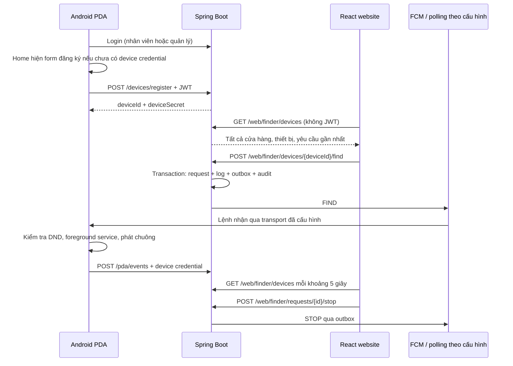

# 21. Website React tìm PDA và đăng ký sau đăng nhập Android

## Luồng mới



Android không còn màn hình tìm các PDA khác. Website là nơi chọn cửa hàng/thiết bị và tìm/dừng. Android giữ đăng ký thiết bị, nhận lệnh, **Finder sound settings**, nút dừng tại máy và ACK.

## Chạy nhanh

1. Khởi động backend bằng Java 8 như [hướng dẫn triển khai](11-deployment.md). Flyway tự áp dụng migration V7 trên lịch sử đang chọn; không sửa checksum các migration cũ.
2. Để chạy FCM, cung cấp credential Firebase, bật `FCM_ENABLED=true` và `app.scheduler-enabled=true`. Profile dev hiện mặc định bật scheduler; có thể ghi đè bằng `APP_SCHEDULER_ENABLED`. Android cần `google-services.json` đúng project và `finderTransport=fcm`.
3. Build/cài Android. Đăng nhập tài khoản EMPLOYEE hoặc MANAGER. Home mở form đăng ký nếu chưa có `deviceId/deviceSecret`: mã mặc định là UUID được giữ cho bản cài, tên mặc định là hãng/model; có thể sửa thành mã tài sản và tên dễ nhận biết.
4. Bấm Register. Backend lấy cửa hàng từ tài khoản đăng nhập, không từ dữ liệu client. Sau thành công Android lưu credential, đồng bộ token, chỉ mở polling service nếu APK chọn polling.
5. Từ thư mục `pda-web`, chạy `npm ci` rồi `npm run dev`, mở http://localhost:5173. Chọn thiết bị và bấm Tìm; không cần đăng nhập web.

Nếu bỏ qua form có thể chọn **Register this PDA** trên Home sau đó. Lần mở Home tiếp theo khi chưa đăng ký sẽ nhắc lại. Máy đã đăng ký không tạo bản ghi mới khi đăng nhập lại; đổi tài khoản/cửa hàng không tự chuyển cửa hàng của PDA. Mã tài sản trùng trả 409; app không chiếm lại credential của bản đăng ký khác. Nếu xóa dữ liệu/cài bằng chữ ký khác, cần quy trình đăng ký lại; không tự nhận lại secret cũ.

## API website: không xác thực

| API | Chức năng |
| --- | --- |
| `DELETE /web/finder/devices/{deviceId}` | Xóa thiết bị và lịch sử finder liên quan; 204/404/409 |
| `GET /web/finder/configuration` | Cờ FCM/scheduler runtime, không có credential |
| `GET /web/finder/devices` | Tất cả cửa hàng và thiết bị; mỗi dòng chứa thông tin cửa hàng, thiết bị và request gần nhất |
| `POST /web/finder/devices/{deviceId}/find` | Tạo request tìm, không cần body |
| `GET /web/finder/requests/{id}` | Trạng thái một request |
| `POST /web/finder/requests/{id}/stop` | Dừng request, không cần body |

GET có `Cache-Control: no-store`. Web còn hiển thị log gần nhất `lastEvent/lastEventMessage` và cảnh báo khi FCM/scheduler tắt. Cửa hàng trống có dòng `deviceId=null`. Danh sách không giới hạn 500 như API manager cũ, để hiển thị toàn hệ thống. Không trả token FCM/secret/hash; chỉ có `hasPushToken`.

```json
{
  "storeId": 1,
  "storeCode": "S1",
  "storeName": "Cửa hàng 1",
  "deviceId": 10,
  "deviceCode": "PDA-001",
  "deviceName": "PDA kho",
  "lastActiveAt": "2026-10-03T10:00:00Z",
  "hasPushToken": true,
  "requestId": null,
  "status": null,
  "expiresAt": null
}
```

Tìm ID không tồn tại trả 404; đang có request còn hạn trả 409. Request hết hạn được xử lý trước lần tìm tiếp theo. Dừng nhiều lần không nhân đôi STOP. Backend xác định cửa hàng từ thiết bị/request trong database; không nhận storeId do web chọn làm thẩm quyền.

API công khai cho phép bất kỳ người nào truy cập được nó xem/tìm/dừng PDA của mọi cửa hàng; cần đặt web/backend trong mạng nội bộ phù hợp. Không có tài khoản manager hoặc token giấu trong React. Các API nghiệp vụ khác vẫn giữ auth, ACK/token/polling vẫn cần credential thiết bị.

Các endpoint manager cũ `/devices`, `/pda/find`, `/pda/find/{id}`, `/pda/stop` vẫn giữ quyền và phạm vi cửa hàng để tương thích client cũ; Android hiện tại không gọi chúng.

## Xóa và đăng ký lại

Nút Xóa yêu cầu xác nhận; API chỉ cho xóa nếu không còn request active chưa hết hạn. Xóa cả lịch sử request/log/outbox liên quan nhưng giữ audit chung. Sau xóa, mở Home trên APK mới: app kiểm tra credential qua `/pda/fcm-health`, nhận 401 thì bỏ đăng ký cũ và hiện form đăng ký lại. Không mất credential khi lỗi mạng. Chi tiết: [tài liệu 22](22-delete-device-and-finder-troubleshooting.md).

## Code backend và database

- [WebFinderController](../pda-management/src/main/java/com/company/pda/presentation/rest/pdafinder/WebFinderController.java): bốn endpoint công khai.
- [WebFinderQueries](../pda-management/src/main/java/com/company/pda/application/port/out/WebFinderQueries.java), [WebFinderMapper.xml](../pda-management/src/main/resources/mapper/WebFinderMapper.xml): projection không chứa secret, LEFT JOIN để có cửa hàng trống và request gần nhất.
- [PdaFinderService](../pda-management/src/main/java/com/company/pda/application/pdafinder/service/PdaFinderService.java): `findFromWeb/statusFromWeb/stopFromWeb`; dùng chung logic tạo/dừng với endpoint manager.
- Migration `V7__allow_web_finder_requests.sql` có ở cả `db/migration` và `db/legacy`: cho phép `requester_id=null`, vì web không có user. Không giả mạo requester bằng người đăng ký thiết bị.
- DTO/entity/model đổi requesterId từ `long` sang `Long` để đọc null an toàn. Audit dùng actor null, operation `PDA_FIND_WEB/PDA_STOP_WEB`, vẫn lưu đúng store và request.
- `DeviceController.register()` chấp nhận MANAGER hoặc EMPLOYEE. Backend vẫn xác thực user và gán cửa hàng/registered_by của tài khoản.

## Trạng thái và transport

Web chỉ dùng HTTP gọi backend. Chu kỳ refresh web không phải polling nhận lệnh của PDA. Android vẫn mặc định FCM; muốn nhận lệnh HTTP phải đổi `finderTransport=polling` rồi build/cài APK như [tài liệu 16](16-fcm-to-polling-fallback.md).

QUEUED: chờ worker; SENT: Firebase chấp nhận gửi; RINGING: Android báo đang phát; FAILED: lỗi; EXPIRED: hết hạn. STOPPED có thể do yêu cầu dừng từ web hoặc ACK Android, không đồng nghĩa PDA offline đã nhận STOP. UI hiện “Hết thời hạn” khi deadline đã qua dù scheduler chưa cập nhật database.

## Kiểm thử

- Backend integration tests dùng PostgreSQL tách biệt: public list đủ cửa hàng, cửa hàng trống, không lộ secret; web FIND → outbox → push giả → ACK → STOP, requester/audit null; 404/409; nhân viên đăng ký đúng cửa hàng và anonymous bị chặn.
- Web: kiểm tra bảng, lọc cửa hàng, Tìm/Dừng, trạng thái, lỗi API, refresh và màn hình nhỏ. Production build bằng `npm run build`.
- Android: build/test/lint; đăng nhập nhân viên trên thiết bị, kiểm tra form đăng ký và không còn menu PDA management; chạy kiểm thử chuông thật theo [tài liệu 20](20-fcm-to-pda-alarm-guide.md).

Xem kết quả đã chạy tại [verification.md](verification.md), không coi build hoặc push giả là bằng chứng giao FCM/loa thật.
