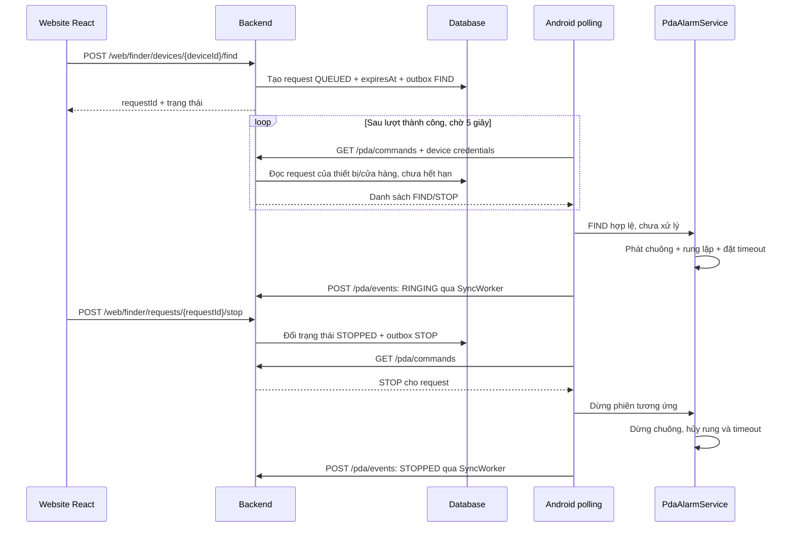

# Hướng dẫn polling và chuông/rung khi tìm PDA

Tài liệu mô tả cơ chế đang triển khai trong dự án: Android chủ động gọi HTTP để nhận lệnh tìm/dừng PDA khi APK được build với `finderTransport=polling`. Mặc định hiện tại là `fcm`; lỗi FCM không tự bật polling. Cả hai chế độ dùng chung `FinderCommandHandler` và `PdaAlarmService`, nên đều phát chuông kèm rung khi phiên tìm PDA bắt đầu thành công.

## 1. Cấu hình và chạy thử

Từ thư mục `pda-android`, build APK cho PDA cần tìm:

```powershell
.\gradlew.bat :app:assembleDebug -PfinderTransport=polling -PapiUrl=http://192.168.1.10:8080/
```

Thay IP bằng địa chỉ backend mà PDA truy cập được; URL phải kết thúc bằng `/`. `10.0.2.2` mặc định chỉ phù hợp Android emulator. Bản debug cho phép HTTP theo debug manifest; dùng HTTPS cho bản release.

Cài `app/build/outputs/apk/debug/app-debug.apk` lên PDA đích, đăng nhập/đăng ký thiết bị và mở Home. Có thể đặt `finderTransport=polling` trong [gradle.properties](../pda-android/gradle.properties), Gradle Sync rồi build lại. Đây là cấu hình lúc build, cần cài lại APK để đổi; website không thay đổi chế độ của PDA.

Khi Home mở hoặc đăng ký thành công, `FinderPollingService.start()` kiểm tra cấu hình và đăng ký thiết bị trước khi khởi động foreground service. PDA hiển thị thông báo thường trực “Receiving finder commands via polling”. Với APK `fcm`, lời gọi này dừng service polling cũ rồi trả về.

Backend cần chạy cùng database và thiết bị đã đăng ký hợp lệ. Polling không cần Firebase token. Nếu toàn bộ PDA dùng polling, có thể đặt `FCM_ENABLED=false`; nếu còn PDA dùng FCM, giữ cấu hình Firebase cho những PDA đó. Bật scheduler để xử lý outbox và cập nhật request hết hạn theo cấu hình triển khai; `/pda/commands` đọc trực tiếp database và không chờ outbox FCM gửi thành công.

## 2. Luồng từ website tới thiết bị



Backend mặc định đặt thời hạn tìm là 60 giây bằng `FINDER_TIMEOUT_SECONDS`; service giới hạn cấu hình trong khoảng 10–300 giây. Mỗi PDA chỉ có một request đang hoạt động; tạo thêm khi request cũ còn hoạt động trả HTTP 409.

## 3. API polling và nhịp gọi

```http
GET /pda/commands
X-Device-Id: 1
X-Device-Secret: <secret được cấp khi đăng ký PDA>
```

Ví dụ response (thời gian minh họa; lệnh thực tế phải còn hạn):

```json
[
  {
    "requestId": "e16d1b16-9a6b-4b48-9fc4-c8b048fa2d85",
    "command": "FIND",
    "expiresAt": "2026-10-06T10:00:00Z"
  }
]
```

Không có lệnh thì trả `[]`. Backend xác thực bằng credential thiết bị, giới hạn đúng thiết bị/cửa hàng và chỉ lấy request có `expires_at > now()`. Trạng thái `QUEUED`, `SENT`, `RINGING` được chuyển thành `FIND`; các trạng thái kết thúc được chuyển thành `STOP` khi request vẫn còn trong thời hạn truy vấn. Response có `Cache-Control: no-store`; GET không xóa request nên cùng lệnh có thể xuất hiện nhiều lượt.

| Kết quả một lượt | Hành vi tiếp theo |
| --- | --- |
| Thành công, kể cả `[]` | Chờ 5 giây rồi gọi lại; đưa nhịp về 5 giây |
| Lỗi mạng, response thiếu body hoặc lỗi HTTP khác 401/403 | Nhân đôi khoảng chờ: 10 → 20 → 40 → 60 giây, tối đa 60 giây |
| HTTP 401/403 | Dừng service; kiểm tra/đăng ký lại credential rồi mở Home |
| Thiếu `deviceId` hoặc `deviceSecret` | Dừng service |
| Service bị hủy | Hủy HTTP đang chạy, executor, callback và wake lock |

Đây là polling tuần tự bằng `ScheduledExecutorService`, không phải long polling hoặc WorkManager định kỳ. Lượt đầu chạy ngay khi service bắt đầu. Thời gian giữa hai lượt gồm thời gian HTTP cộng khoảng chờ; vì vậy “5 giây” không phải cam kết nhận lệnh trong 5 giây. Network client cấu hình connect timeout 10 giây, read timeout 20 giây và call timeout 30 giây.

APK polling bỏ qua FIND/STOP nhận qua FCM. `/pda/fcm-health` không được gọi trong vòng polling và không quyết định đổi transport; Home vẫn có thể gọi health một lần khi resume để kiểm tra đăng ký.

## 4. Xử lý trùng lệnh và gửi trạng thái

`FinderCommandHandler` chạy trên main thread. FIND phải có UUID hợp lệ, deadline parse được và chưa hết hạn. Request đã đánh dấu `handled:<requestId>` hoặc đang là `PdaAlarmService.activeId` sẽ bị bỏ qua: nhiều response FIND không khởi động lại chuông/rung hoặc kéo dài thời hạn.

STOP ghi dấu `handled:<requestId>` trước khi dừng phiên tương ứng. Dấu này chặn FIND đến trễ khởi động lại phiên đã dừng. STOP cho request khác không dừng phiên đang hoạt động.

Sự kiện `RINGING`, `STOPPED`, `FAILED` được ghi vào Room rồi gửi `POST /pda/events` bằng `SyncWorker` khi có mạng. Lỗi tạm thời được retry theo WorkManager với backoff exponential bắt đầu từ 30 giây. Đây là luồng ACK riêng, không phải vòng polling 5 giây. Trạng thái website có thể cập nhật trễ khi ACK còn trong hàng đợi.

## 5. Chuông và rung trên Android

Trong [PdaAlarmService](../pda-android/app/src/main/java/com/company/pda/infrastructure/alarm/PdaAlarmService.java), sau khi alarm adapter trả kết quả đang reo, service bắt đầu rung theo mẫu **rung 500 ms, nghỉ 500 ms**, lặp đến khi phiên được giải phóng. Manifest khai báo `android.permission.VIBRATE`; không có hộp thoại xin quyền runtime cho quyền này.

Android 12 trở lên lấy bộ rung mặc định qua `VibratorManager`; Android 8–11 lấy `Vibrator`. Android 13 trở lên dùng `VibrationAttributes.USAGE_ALARM`, bản cũ dùng `AudioAttributes.USAGE_ALARM` để gắn rung với báo động. Xem API chính thức: [Vibrator](https://developer.android.com/reference/android/os/Vibrator), [VibratorManager](https://developer.android.com/reference/android/os/VibratorManager).

Rung được hủy trong `release()`, cùng vòng đời chuông: dừng từ website, nút Stop alarm trên notification/giao diện, hết deadline, mất audio focus, lỗi kiểm tra âm thanh, thay phiên hoặc service bị hủy. Lệnh trùng/đã xử lý/hết hạn không bắt đầu rung mới.

Nếu máy không có motor rung hoặc API rung báo lỗi, chuông vẫn tiếp tục và lỗi rung được ghi log với tag `PdaAlarm`. Rung là tín hiệu bổ sung; `RINGING` vẫn phản ánh kiểm tra phát âm thanh, không xác nhận motor đang rung thực tế. Chính sách DND/OEM có thể chặn rung; khi adapter không thể bắt đầu chuông, service không bắt đầu rung riêng. Màn hình thử loa vẫn chỉ thử âm thanh.

## 6. Chạy nền và kiểm tra trên PDA

Polling dùng foreground service loại `specialUse` và partial wake lock có lease 10 phút, gia hạn mỗi vòng. Cấu hình EMM/OEM cần cho phép chạy nền và duy trì kết nối mạng khi khóa màn hình. `START_STICKY` không bảo đảm service luôn sống; sau force-stop hoặc reboot, mở lại Home vì chưa có boot receiver tự khởi động polling.

1. Cài APK polling, đăng ký PDA, mở Home và kiểm tra notification polling.
2. Trên website chọn đúng PDA rồi bấm Tìm: máy phát chuông và rung 500/500 ms; trạng thái chuyển sang `RINGING` khi ACK tới backend.
3. Bấm Dừng trên website: ở lượt polling tiếp theo, chuông và rung cùng dừng. Thử riêng nút Stop alarm trên notification và nút dừng trên giao diện.
4. Tìm lại và chờ hết thời hạn: cả chuông và rung tự dừng, không cần nhận STOP qua mạng. Kiểm tra lại với màn hình khóa.
5. Trong lúc đang tìm, ngắt mạng: phiên vẫn tự dừng theo deadline; ACK chờ gửi lại. Nếu ngắt mạng trước FIND, máy không nhận được lệnh; FIND hết hạn không reo/rung muộn.
6. Kiểm tra FIND lặp, STOP trước FIND, credential sai, DND và máy không hỗ trợ rung. FIND lặp không khởi động lại mẫu rung; máy không hỗ trợ rung vẫn phát chuông nếu audio cho phép.
7. Build lại `-PfinderTransport=fcm`, cài và mở Home: polling dừng; FIND qua FCM vẫn phát chuông kèm rung qua cùng service.

## 7. Các file liên quan

| Thành phần | File |
| --- | --- |
| Cấu hình transport lúc build | [app/build.gradle](../pda-android/app/build.gradle) |
| Vòng polling, backoff, foreground service | [FinderPollingService.java](../pda-android/app/src/main/java/com/company/pda/infrastructure/firebase/FinderPollingService.java) |
| Gọi commands khi bật polling | [FinderPollingCycle.java](../pda-android/app/src/main/java/com/company/pda/infrastructure/firebase/FinderPollingCycle.java) |
| Kiểm tra FIND/STOP và chống lệnh trùng | [FinderCommandHandler.java](../pda-android/app/src/main/java/com/company/pda/infrastructure/firebase/FinderCommandHandler.java) |
| Chuông, rung và cleanup | [PdaAlarmService.java](../pda-android/app/src/main/java/com/company/pda/infrastructure/alarm/PdaAlarmService.java) |
| Hàng đợi ACK và retry | [SyncWorker.java](../pda-android/app/src/main/java/com/company/pda/infrastructure/firebase/SyncWorker.java) |
| HTTP commands/events | [PdaFinderController.java](../pda-management/src/main/java/com/company/pda/presentation/rest/pdafinder/PdaFinderController.java) |
| Ánh xạ trạng thái thành FIND/STOP | [PdaFinderService.java](../pda-management/src/main/java/com/company/pda/application/pdafinder/service/PdaFinderService.java) |
| Truy vấn request chưa hết hạn | [PdaFindMapper.xml](../pda-management/src/main/resources/mapper/PdaFindMapper.xml) |

Đọc thêm: [polling hiện có](15-finder-polling.md), [chọn FCM/polling](16-fcm-to-polling-fallback.md), [luồng FCM tới chuông](20-fcm-to-pda-alarm-guide.md), [website tìm PDA](21-react-device-finder.md).
