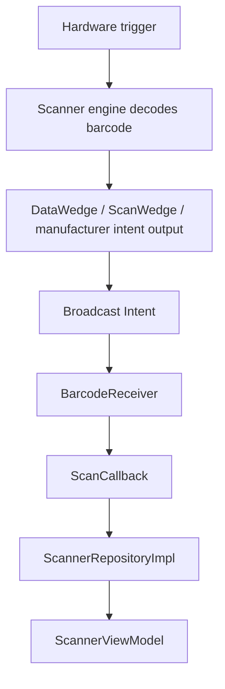

# Broadcast scanner integration



All hardware manufacturer options use `IntentScannerManager` and `BarcodeReceiver`.
In **Scanner settings**, select the manufacturer, press **Use selected scanner defaults**,
then edit the action/key to match the device profile. Custom settings are preserved
until changed. Other manufacturers can use **INTENT** if their wedge supports broadcasts
with string or UTF-8 byte payloads. Keyboard and camera remain separate input modes.

| Type | Default action | Payload key | Symbology key |
|---|---|---|---|
| ZEBRA | `com.company.pda.SCAN` | `com.symbol.datawedge.data_string` | `com.symbol.datawedge.label_type` |
| UROVO | `android.intent.ACTION_DECODE_DATA` | `barcode_string` | `barcodeType` |
| HONEYWELL | `com.company.pda.SCAN` | `data` | `codeId` |
| INTENT | `com.company.pda.SCAN` | `data` | `symbology` |

`com.company.pda.SCAN` is app-defined, not a universal factory default. Configure the
manufacturer wedge to send Broadcast Intents to the matching action and disable
keyboard output. Enable broadcast output in Urovo ScanWedge; firmware may require a
custom action/key. If `barcode_string` is absent, the Urovo adapter reads `barcode`
bytes and validates the optional `length` before UTF-8 decoding.

For Honeywell, configure the device's Data Collection intent profile for the action
above (or enter its existing action). The adapter does not automatically claim or
configure the scanner via the Honeywell Intent API; the device's scanner service/profile
must already be enabled for broadcast output.

The receiver accepts the configured action with no category or DEFAULT category.
It is dynamically registered as exported so the external vendor service can send
results, with an optional sender permission. Only set a permission actually held by
the vendor service. `stop()` disables callbacks before unregistering; restarting
replaces the receiver. No manifest receiver runs while the scanning screen is stopped.

Malformed, missing or blank payloads are ignored. Full barcode text and available
symbology reach the ViewModel; the existing use case reports its 1-50 character
validation error instead of silently dropping long scans.

On each device, verify one event per hardware scan, custom action/key, missing payload,
repeated start/stop, rotation and no delivery after leaving the screen.
With the scanning screen active and INTENT defaults selected, test a synthetic event:

```sh
adb shell am broadcast -a com.company.pda.SCAN -p com.company.pda --es data 123456 --es symbology CODE128
```

Hardware scanning still needs device testing; synthetic broadcasts only verify the
app receive path. Software triggering is available for Zebra DataWedge, compatible Urovo ScanWedge and CAMERA;
Honeywell and generic intent mode use the physical trigger. See [Urovo API requirements](../scanner-urovo/README.md).

References: [Urovo constants](https://www.urovo.com/developer/constant-values.html),
[Honeywell Intent API](https://support.honeywellaidc.com/servlet/fileField?entityId=ka02K000000cS1bQAE&field=File_1__Body__s),
[Zebra setup](../scanner-zebra/README.md).
