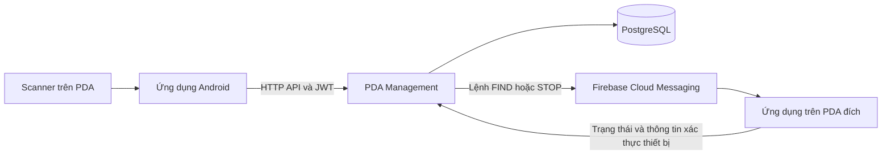
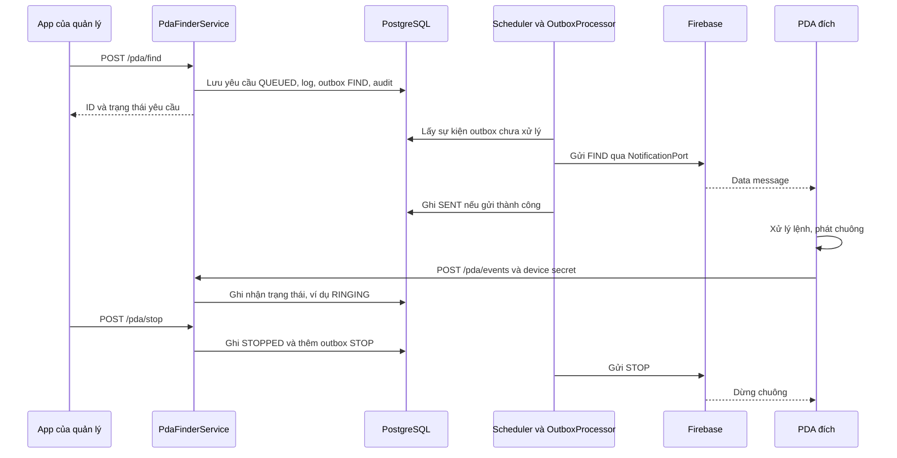

# Giải thích dự án PDA Management

Tài liệu mô tả mã nguồn trong `pda-management`, cập nhật ngày 26/09/2026. Cây thư mục đầy đủ nằm trong [STRUCTURE.md](STRUCTURE.md).

## 1. Dự án làm gì?

`pda-management` là backend Spring Boot phục vụ ứng dụng Android trên thiết bị PDA dùng trong cửa hàng. Backend cung cấp API, xác thực người dùng, xử lý nghiệp vụ, lưu dữ liệu PostgreSQL và gửi lệnh tìm thiết bị qua Firebase Cloud Messaging (FCM).

| Chức năng | Công việc của backend |
|---|---|
| Đăng nhập | Kiểm tra tài khoản, cấp access token và refresh token |
| Quản lý thiết bị | Đăng ký PDA theo cửa hàng, cấp định danh/bí mật thiết bị, cập nhật FCM token |
| Tìm PDA | Tạo yêu cầu tìm, gửi lệnh phát/dừng chuông và nhận trạng thái từ PDA |
| Tra cứu sản phẩm | Tìm sản phẩm theo barcode, trả thông tin và URL ảnh |
| Tồn kho | Xem tồn, điều chỉnh số lượng, lưu lịch sử giao dịch |
| Thanh lý | Tạo phiếu, xác nhận hoặc hủy; trừ tồn khi xác nhận |

Scanner, nút quét vật lý, `BroadcastReceiver`, hiển thị ảnh và phát chuông nằm trong dự án Android `pda-android`. Backend không trực tiếp điều khiển scanner Zebra/Urovo. Android nhận barcode rồi gửi giá trị đó đến API tra cứu sản phẩm.



Các công nghệ chính: Java 21, Spring Boot 3.5.6, Spring Security, MyBatis, PostgreSQL, Flyway, Firebase Admin SDK, MapStruct và Maven. Phiên bản dependency được quản lý trong [pom.xml](pom.xml).

## 2. Cách tổ chức thư mục

```text
pda-management/
├── pom.xml                     Cấu hình Maven và dependency
├── Dockerfile                  Build và đóng gói backend vào container
├── .env.example                Mẫu biến môi trường
├── README.md                   Hướng dẫn nhanh
├── STRUCTURE.md                Cây thư mục chi tiết
├── PROJECT_GUIDE.vi.md         Tài liệu này
└── src/
    ├── main/
    │   ├── java/com/company/pda/
    │   │   ├── PdaApplication.java
    │   │   ├── domain/
    │   │   ├── application/
    │   │   ├── infrastructure/
    │   │   └── presentation/
    │   └── resources/
    │       ├── application.yml
    │       ├── application-dev.yml
    │       ├── application-prod.yml
    │       ├── db/migration/
    │       ├── db/legacy/
    │       └── mapper/
    └── test/java/com/company/pda/
        ├── domain/
        ├── application/
        ├── infrastructure/
        └── presentation/
```

`target/` do Maven sinh khi build, chứa file `.class`, JAR và báo cáo test. Đây không phải thư mục chứa mã nguồn cần chỉnh sửa.

### `domain`: mô hình và hợp đồng nghiệp vụ

Chia thành `auth`, `device`, `pdafinder`, `product`, `inventory`, `disposal`, `shared`.

| Thư mục con | Vai trò | Ví dụ |
|---|---|---|
| `model` | Biểu diễn dữ liệu và trạng thái nghiệp vụ | `Device`, `Inventory`, `DisposalStatus` |
| `repository` | Interface mô tả các thao tác đọc/ghi mà nghiệp vụ cần | `InventoryRepository` |
| `exception` | Lỗi nghiệp vụ có tên và ý nghĩa cụ thể | `InsufficientInventoryException` |
| `shared` | Thành phần dùng chung giữa các nghiệp vụ | `Actor`, `AuditInfo`, `DomainException` |

Domain không chứa SQL hoặc mã gọi Firebase. Ví dụ, `InventoryRepository` chỉ định nghĩa cần tìm/cập nhật tồn kho; cách thực hiện bằng MyBatis nằm ở infrastructure.

### `application`: điều phối các thao tác nghiệp vụ

Mỗi tính năng có các nhóm `usecase`, `service`, `dto` tùy nhu cầu thực tế:

- `usecase`: interface cho hành động như `LoginUseCase`, `FindPdaUseCase`, `AdjustInventoryUseCase`.
- `service`: triển khai hành động, kiểm tra điều kiện, gọi repository và xác định transaction.
- `dto`: command đầu vào và result đầu ra của application, ví dụ `FindPdaCommand`, `FindPdaResult`.
- `port/out`: hợp đồng với các khả năng bên ngoài, như tạo token, gửi thông báo, ghi audit và lấy người dùng hiện tại.

Các interface tổng hợp như `AuthUseCase`, `FinderUseCase` gom nhiều thao tác cùng tính năng để controller sử dụng. Chúng không phải một service triển khai khác.

Code hiện tại áp dụng hướng phân tầng Clean Architecture nhưng application service vẫn dùng `@Service`, `@Transactional` và một số tiện ích Spring/Jackson. Không nên hiểu rằng application đã hoàn toàn độc lập framework.

### `infrastructure`: triển khai kỹ thuật

| Thư mục | Trách nhiệm |
|---|---|
| `persistence/mybatis/entity` | Kiểu dữ liệu nhận kết quả từ database |
| `persistence/mybatis/mapper` | Interface mapper để MyBatis thực thi SQL |
| `persistence/mybatis/repository` | Triển khai các repository/port bằng mapper |
| `persistence/mybatis/converter` | Chuyển entity của persistence sang model domain |
| `security` | JWT, BCrypt, người dùng hiện tại và tạo admin ban đầu |
| `firebase` | Khởi tạo Firebase, gửi FCM và lịch xử lý outbox |
| `integration/erp` | HTTP client tùy chọn để gọi ERP |
| `integration/image` | HTTP client tùy chọn để gọi máy chủ ảnh |
| `config` | Cấu hình quét mapper và quản lý transaction |

SQL nằm trong `src/main/resources/mapper/*.xml`. Namespace XML phải khớp tên đầy đủ của interface mapper Java; ID câu SQL tương ứng với tên phương thức.

### `presentation`: giao tiếp HTTP

- `rest/<tính năng>`: controller và DTO HTTP, nhận request, validation, gọi use case, trả response.
- `exception`: chuyển lỗi nghiệp vụ/validation/database thành HTTP response.
- `filter`: xử lý chung quanh request. `RequestLogFilter` gắn `X-Request-ID`, ghi phương thức, nhóm đường dẫn, mã HTTP và thời gian xử lý.

Validation HTTP như `@NotNull`, `@NotBlank`, `@Digits` nằm ở request DTO. Các điều kiện như thiết bị phải cùng cửa hàng, phiếu còn chờ xử lý hoặc tồn không được âm được kiểm tra trong nghiệp vụ và ràng buộc database.

## 3. Một request đi qua các tầng thế nào?

Ví dụ điều chỉnh tồn kho:

```mermaid
sequenceDiagram
    participant App as Android
    participant Security as Spring Security
    participant C as InventoryController
    participant S as InventoryService
    participant R as MyBatisInventoryRepository
    participant M as InventoryMapper và XML
    participant DB as PostgreSQL
    App->>Security: POST /inventory-adjustments và access token
    Security->>C: Đã xác thực; kiểm tra quyền MANAGER
    C->>C: Validate AdjustInventoryRequest
    C->>S: adjust(request.toCommand())
    S->>S: Xác định cửa hàng, kiểm tra requestId và version
    S->>R: Đọc/cập nhật tồn, lưu lịch sử
    R->>M: Gọi phương thức mapper
    M->>DB: Thực thi SQL trong transaction
    DB-->>R: Dữ liệu và số bản ghi cập nhật
    R-->>S: Model domain
    S-->>C: Kết quả tồn kho
    C-->>App: HTTP response
```

Trong mã nguồn, `InventoryService` phụ thuộc **interface** `InventoryRepository`, không phụ thuộc lớp `MyBatisInventoryRepository`. Spring inject implementation MyBatis khi khởi động.

Các loại đối tượng có tên gần nhau phục vụ những ranh giới khác nhau:

| Đối tượng | Mục đích |
|---|---|
| `AdjustInventoryRequest` | Nhận JSON và kiểm tra dữ liệu HTTP |
| `AdjustInventoryCommand` | Mang yêu cầu vào application service |
| `Inventory` | Model tồn kho dùng trong nghiệp vụ |
| `InventoryEntity` | Dữ liệu từ truy vấn MyBatis |
| `InventoryEntityMapper` | Chuyển entity sang domain |
| `InventoryMapper` | Khai báo phương thức SQL; khác với converter ở hàng trên |

Một số API hiện trả trực tiếp domain model hoặc `Map`/`Object`, ví dụ API tồn kho và chi tiết thanh lý. Không phải tất cả endpoint đã có response DTO riêng. MapStruct hiện được dùng cho `ProductDtoMapper`; các converter persistence không đồng nghĩa đều do MapStruct sinh.

## 4. Luồng hoạt động của từng tính năng

### 4.1. Đăng nhập và gia hạn phiên

1. Android gửi username/password đến `POST /auth/login`.
2. `AuthController` chuyển `LoginRequest` thành `LoginCommand`.
3. `AuthenticationService` tìm tài khoản, kiểm tra mật khẩu qua `PasswordHasher` và trạng thái hoạt động.
4. `TokenProvider`, được triển khai bởi `JwtTokenProvider`, tạo access token 15 phút và refresh token 14 ngày.
5. Server lưu hash refresh token cùng thông tin phiên trong `refresh_tokens`, ghi audit rồi trả token cho Android.

Request có access token đi qua `JwtAuthenticationFilter`. Decoder kiểm tra chữ ký, issuer, hạn dùng, `type=access` và audience; roles được ánh xạ thành quyền `ROLE_*`. Các service dùng `CurrentActor` để lấy người dùng/cửa hàng; `SecurityCurrentActor` kiểm tra lại tài khoản đang hoạt động và cửa hàng khớp dữ liệu token.

Khi gọi `POST /auth/refresh`, server đánh dấu refresh token cũ đã dùng và cấp cặp token mới. Tái sử dụng token đã dùng làm thu hồi nhóm token cùng phiên. Refresh token không dùng để gọi API nghiệp vụ.

### Đăng ký tài khoản nhân viên

`POST /auth/register` cho phép người đã đăng nhập với quyền `MANAGER` tạo một tài khoản `EMPLOYEE` trong cửa hàng của mình. Đây là đăng ký tài khoản người dùng, khác với `/devices/register` là đăng ký PDA.

```http
POST /auth/register
Authorization: Bearer <access-token-cua-manager>
Content-Type: application/json
```

```json
{
  "username": "employee01",
  "password": "Employee-demo-2026!",
  "fullName": "Nguyễn Văn A",
  "email": "employee01@example.test"
}
```

Thành công trả HTTP `201`, ví dụ:

```json
{"id": 5, "username": "employee01", "storeId": 1, "role": "EMPLOYEE"}
```

ID thực tế do database sinh. Request không có trường chọn cửa hàng hoặc cấp quyền; service lấy cửa hàng từ quản lý hiện tại và luôn gán `EMPLOYEE`. Username dài 3–100 ký tự, chỉ gồm chữ Latin, số, dấu chấm, gạch dưới và gạch nối; ký tự đầu phải là chữ hoặc số. Mật khẩu tối thiểu 12 ký tự, tối đa 72 byte UTF-8 để phù hợp BCrypt. `fullName` bắt buộc; email có thể bỏ qua.

Controller chuyển `RegisterUserRequest` sang `RegisterUserCommand`; `UserRegistrationService` kiểm tra người tạo, username, hash mật khẩu, lưu user/role/audit trong một transaction. Response không trả mật khẩu hoặc hash. Chưa đăng nhập trả `401`, thiếu quyền trả `403`, dữ liệu không hợp lệ trả `400`, trùng username trả `409`. Tạo tài khoản không đổi phiên đăng nhập của quản lý; nhân viên dùng tài khoản mới với `/auth/login`.

Quản lý đầu tiên có thể được tạo bằng bootstrap hoặc seed ở môi trường dev như bên dưới. Phần này bổ sung API backend; hiện chưa thêm màn hình tạo tài khoản vào ứng dụng Android.

### 4.2. Đăng ký và xác thực PDA

Người có quyền `MANAGER` gọi `POST /devices/register`. `DeviceService` gắn thiết bị với cửa hàng của người đăng ký, sinh `deviceSecret`, lưu hash của secret và trả `deviceId` cùng secret cho Android.

Có hai cơ chế xác thực khác nhau:

| Cơ chế | Sử dụng |
|---|---|
| `Authorization: Bearer <accessToken>` | Thao tác của người dùng như tìm PDA, điều chỉnh tồn |
| `X-Device-Id` và `X-Device-Secret` | PDA cập nhật FCM token hoặc gửi sự kiện trạng thái chuông |

`PUT /devices/token` và `POST /pda/events` được cho qua bước bắt buộc JWT, nhưng vẫn kiểm tra thông tin xác thực thiết bị trong service. Chúng không phải API cho phép cập nhật dữ liệu mà không xác thực.

Có FCM token không chứng minh PDA đang online; trạng thái gửi/nhận cần xem theo yêu cầu tìm thiết bị.

### 4.3. Tìm PDA và dừng chuông



`PdaFinderService` kiểm tra PDA thuộc cửa hàng hiện tại và có FCM token. Yêu cầu, log, outbox và audit được ghi trong cùng transaction. Sau đó `OutboxScheduler` gọi xử lý hết hạn và xử lý một sự kiện, với khoảng nghỉ 1 giây giữa các lần chạy.

Outbox là bảng lưu việc cần gửi thông báo. Nhờ lưu cùng transaction với yêu cầu tìm, server không phải dựa vào việc controller còn đang chạy để nhớ gửi FCM. Worker dùng `FOR UPDATE SKIP LOCKED` khi lấy sự kiện; lỗi tạm thời được lên lịch thử lại. Cách này vẫn có khả năng gửi lại một lệnh nếu lần gửi trước thành công nhưng transaction chưa được ghi nhận, nên phía nhận cần xử lý theo `requestId`.

| Trạng thái | Ý nghĩa trong backend |
|---|---|
| `QUEUED` | Yêu cầu đã được lưu, đang chờ xử lý gửi |
| `SENT` | Gửi lệnh FIND qua FCM thành công; chưa chứng minh loa đang phát |
| `RINGING` | PDA đã báo trạng thái đang phát chuông |
| `STOPPED` | Yêu cầu đã chuyển sang dừng; khi quản lý bấm dừng, backend ghi trạng thái này trước khi PDA nhận STOP |
| `EXPIRED` | Đã quá thời hạn yêu cầu |
| `FAILED` | Thiếu token, token không hợp lệ hoặc gặp lỗi gửi không thể tiếp tục theo chính sách hiện tại |

`FINDER_TIMEOUT_SECONDS` mặc định 60 giây, được service giới hạn trong khoảng 10–300 giây. FCM token bị báo `UNREGISTERED` sẽ được vô hiệu hóa. Mỗi PDA chỉ có một yêu cầu đang hoạt động nhờ unique index trong database.

Chi tiết phía Android: [tài liệu luồng tìm thiết bị](../docs/14-device-finder-flow.md).

### 4.4. Tra cứu sản phẩm và ảnh

Android nhận barcode từ scanner, gọi `GET /products/barcode/{barcode}`. `ProductController` gọi `ProductService`, service đọc `ProductRepository` và chuyển kết quả thành `ProductResult`: `barcode`, `productCode`, `productName`, `imageUrl`. Android tải ảnh từ `imageUrl`.

`PUT /products/image-sync` dành cho role `ERP`: cập nhật URL ảnh theo `sourceVersion`, ghi nhận lần đồng bộ được áp dụng hoặc đã cũ, và ghi audit. Phiên bản cũ không ghi đè phiên bản mới.

Hai client trong `infrastructure/integration` là adapter tùy chọn, chưa được gọi trong luồng `ProductService.lookup` mặc định:

- `ErpProductClient`: được tạo khi có `app.integration.erp.product-url`; URL chứa `{barcode}`, phản hồi theo cấu trúc `ProductResult`.
- `ProductImageClient`: được tạo khi có `app.integration.image.product-url`; URL chứa `{productCode}`, phản hồi là nội dung ảnh.

Cấu hình hai URL chỉ tạo bean tương ứng; không tự chuyển API tra cứu từ database sang ERP. Khi triển khai tích hợp thật cần nối use case với adapter và cấu hình hợp đồng/xác thực của nhà cung cấp.

### 4.5. Điều chỉnh tồn kho

`GET /inventories/{productCode}` đọc tồn trong cửa hàng hiện tại. `POST /inventory-adjustments` đặt tồn về **số lượng mới**, không phải cộng thêm số lượng trong request.

Ví dụ: tồn hiện tại là 10, gửi `quantity=8` thì tồn mới là 8 và lịch sử ghi thay đổi `-2`.

`InventoryService.adjust` khóa thao tác theo cửa hàng, kiểm tra `requestId`, tìm sản phẩm, kiểm tra `version`, cập nhật tồn và lưu adjustment, transaction, audit trong cùng transaction database.

- `requestId`: nhận diện lần thao tác; gửi lại cùng ID và cùng nội dung không tạo điều chỉnh thứ hai. Dùng cùng ID cho nội dung khác bị từ chối.
- `version`: phát hiện dữ liệu người dùng đang sửa đã cũ; cần tải lại nếu có xung đột.
- `BigDecimal` và `NUMERIC(18,2)`: dùng cho số lượng; dữ liệu không được âm.

`GET /inventory-transactions?afterId=...` trả lịch sử theo cursor tăng dần, phục vụ quản lý hoặc ERP đọc các thay đổi tồn kho.

### 4.6. Thanh lý

`POST /disposals` tạo phiếu `PENDING`, lưu các dòng hàng, lịch sử và audit. Tạo phiếu chưa trừ tồn. Một phiếu không được có sản phẩm trùng lặp.

Khi xác nhận, `DisposalService` khóa thao tác theo cửa hàng và khóa phiếu, kiểm tra trạng thái/version, rồi gọi `InventoryAdjustmentPort` để trừ tồn từng sản phẩm. `InventoryService` triển khai port này. Tất cả diễn ra trong transaction của thao tác xác nhận: nếu một sản phẩm thiếu tồn, toàn bộ xác nhận bị rollback.

```text
PENDING ── confirm ──> CONFIRMED  (trừ tồn và ghi giao dịch)
PENDING ── cancel  ──> CANCELLED  (không trừ tồn)
```

Gọi lại thao tác chuyển sang đúng trạng thái hiện có trả phiếu hiện tại. Phiếu đã kết thúc không được chuyển sang trạng thái kết thúc khác bằng các API này; hiện không có luồng hủy phiếu đã xác nhận để tự hoàn tồn.

## 5. Danh sách API và quyền

Các nghiệp vụ theo cửa hàng như quản lý PDA, tồn kho và thanh lý lấy phạm vi cửa hàng từ người dùng hiện tại trong service. Danh mục sản phẩm được dùng chung.

| Method | Endpoint | Xác thực/quyền |
|---|---|---|
| POST | `/auth/login` | Username/password |
| POST | `/auth/refresh` | Refresh token trong body |
| POST | `/auth/register` | JWT, `MANAGER`; tạo nhân viên cùng cửa hàng |
| GET | `/devices` | JWT, `MANAGER` |
| POST | `/devices/register` | JWT, `MANAGER` |
| PUT | `/devices/token` | Device ID và secret |
| POST | `/pda/find` | JWT, `MANAGER` |
| GET | `/pda/find/{id}` | JWT, `MANAGER` |
| POST | `/pda/stop` | JWT, `MANAGER` |
| POST | `/pda/events` | Device ID và secret |
| GET | `/products/barcode/{barcode}` | JWT |
| PUT | `/products/image-sync` | JWT, `ERP` |
| GET | `/inventories/{productCode}` | JWT |
| POST | `/inventory-adjustments` | JWT, `MANAGER` |
| GET | `/inventory-transactions` | JWT, `MANAGER` hoặc `ERP` |
| GET | `/disposals` | JWT |
| GET | `/disposals/{id}` | JWT |
| POST | `/disposals` | JWT, `MANAGER` hoặc `EMPLOYEE` |
| POST | `/disposals/{id}/confirm` | JWT, `MANAGER` |
| POST | `/disposals/{id}/cancel` | JWT, `MANAGER` |
| GET | `/actuator/health` | Không bắt buộc JWT |

Payload và ví dụ chi tiết: [API contracts](../docs/07-api-contracts.md). `GlobalExceptionHandler` xử lý lỗi ở tầng MVC theo `ErrorResponse` dựa trên `ProblemDetail`; lỗi từ security filter có thể được trả bởi handler riêng của Spring Security.

## 6. Database và migration

| File | Bảng chính |
|---|---|
| `V1__create_auth_tables.sql` | `stores`, `users`, `roles`, `user_roles`, `refresh_tokens`, `audit_logs` |
| `V2__create_device_tables.sql` | `devices` |
| `V3__create_pda_finder_tables.sql` | `pda_find_requests`, `pda_alert_logs`, `outbox_events` |
| `V4__create_product_tables.sql` | `products`, `product_image_sync_logs` |
| `V5__create_inventory_tables.sql` | `inventories`, `inventory_adjustments`, `inventory_transactions` |
| `V6__create_disposal_tables.sql` | `disposals`, `disposal_items`, `disposal_histories`; bổ sung khóa ngoại từ giao dịch tồn kho sang phiếu thanh lý |

Flyway tự chạy khi khởi động với cấu hình mặc định. V6 bổ sung khóa ngoại nói trên vì bảng `disposals` chưa tồn tại khi V5 chạy.

Database mới dùng `classpath:db/migration`. Database đã chạy file `V1__retail_schema.sql` trước khi tái cấu trúc cần đặt `SPRING_FLYWAY_LOCATIONS=classpath:db/legacy`. Bản legacy giữ nguyên nội dung V1 cũ. Chọn một trong hai lịch sử, không ghép cả hai vì trùng version 1.

Thay đổi schema mới cho lịch sử sáu migration dùng V7 trở đi; không sửa migration đã chạy. Lịch sử legacy cần được quản lý riêng cho đến khi có quy trình chuyển đổi rõ ràng. Không có bước tự động reset database trong lần tái cấu trúc này.

## 7. Cấu hình và cách chạy

### Các cấu hình thường dùng

| Biến/property | Ý nghĩa |
|---|---|
| `DATABASE_URL` | JDBC URL; mặc định `jdbc:postgresql://localhost:5432/retail` |
| `DATABASE_USER`, `DATABASE_PASSWORD` | Tài khoản PostgreSQL; user mặc định `retail` |
| `JWT_SECRET` | Chuỗi Base64 của ít nhất 32 byte ngẫu nhiên |
| `SPRING_PROFILES_ACTIVE` | Chọn `dev` hoặc `prod`; nếu không đặt thì dùng profile mặc định |
| `SPRING_FLYWAY_LOCATIONS` | Vị trí migration; mặc định Flyway là `classpath:db/migration` |
| `FCM_ENABLED` | Mặc định `false`; bật để khởi tạo Firebase SDK |
| `GOOGLE_APPLICATION_CREDENTIALS` | Đường dẫn credential cho Application Default Credentials, khi sử dụng file credential |
| `FINDER_TIMEOUT_SECONDS` | Thời hạn tìm PDA, mặc định 60 giây |
| `APP_SCHEDULER_ENABLED` | Profile `dev` đọc biến này, mặc định `false`; khi không dùng profile `dev`, có thể đặt property `app.scheduler-enabled` trực tiếp |
| `APP_BOOTSTRAP_ENABLED`, `BOOTSTRAP_PASSWORD` | Bật khởi tạo admin ban đầu; password tối thiểu 16 ký tự |
| `APP_SEED_ENABLED`, `SEED_PASSWORD` | Bật dữ liệu mẫu khi chạy profile `dev`; mật khẩu ít nhất 12 ký tự, tối đa 72 byte UTF-8 |

`application.yml` chứa cấu hình chung. `application-dev.yml` tắt scheduler theo mặc định; `application-prod.yml` bổ sung cấu hình connection pool và forwarded headers. Scheduler mặc định được tạo khi property `app.scheduler-enabled` không được đặt.

`FCM_ENABLED=false` cho phép backend khởi động mà không có Firebase credentials, nhưng không giả lập gửi thành công. Nếu scheduler vẫn chạy, các lệnh cần gửi FCM sẽ gặp lỗi gửi và được xử lý theo cơ chế retry/hết hạn.

### Chạy bằng Maven hoặc JAR

Cài JDK 21 và Maven; chuẩn bị PostgreSQL và cấu hình các biến môi trường cần thiết cho tiến trình Java. Từ thư mục `pda-management`:

```powershell
# Kiểm tra build và chạy test hiện có
mvn verify

# Chạy backend với profile dev
mvn spring-boot:run "-Dspring-boot.run.profiles=dev"

# Hoặc chạy JAR đã build
java -jar target/pda-management-1.0.0.jar --spring.profiles.active=dev
```

Khi chạy Maven/Java trực tiếp, file `.env` không tự được nạp bởi cấu hình hiện tại. Cần đặt biến môi trường qua terminal, IDE hoặc cơ chế triển khai. Muốn thử gửi tìm PDA trong profile `dev`, bật cả FCM và scheduler, đồng thời cung cấp credentials hợp lệ.

### Chạy bằng Docker Compose

Compose nằm ở workspace cha, cùng cấp với thư mục `pda-management`. Chạy từ workspace đó:

```powershell
Copy-Item .env.example .env
# Điền DATABASE_PASSWORD, JWT_SECRET và các giá trị cần thiết trong .env.
docker compose up --build -d
```

Compose khởi động PostgreSQL và backend, truyền biến môi trường được khai báo trong `compose.yaml`. Backend được công bố tại `127.0.0.1:8080`; kiểm tra bằng `GET /actuator/health`. File credential Firebase chưa được tự mount bởi Compose mặc định.

Lần khởi tạo đầu có thể bật bootstrap. Nếu bảng `users` trống, `BootstrapAdmin` tạo cửa hàng `STORE-001` và tài khoản `admin` có role `MANAGER`. Sau khi khởi tạo, tắt bootstrap và bỏ mật khẩu bootstrap khỏi môi trường chạy. Database mới không tự có sản phẩm hoặc tồn kho mẫu để sử dụng.

### Seed dữ liệu mẫu

Có thể seed dữ liệu để thử đăng nhập, quét barcode, điều chỉnh tồn và thanh lý. [DevelopmentDataSeeder](src/main/java/com/company/pda/infrastructure/persistence/seed/DevelopmentDataSeeder.java) chạy sau Flyway, chỉ khi **profile `dev` được bật, profile `prod` không được bật, và `APP_SEED_ENABLED=true`**. Seed mặc định tắt, không nằm trong migration V1–V6.

Chuẩn bị database và các biến `DATABASE_PASSWORD`, `JWT_SECRET` như phần cấu hình. Từ thư mục `pda-management`, chạy PowerShell:

```powershell
$env:SPRING_PROFILES_ACTIVE = "dev"
$env:APP_SEED_ENABLED = "true"
$env:SEED_PASSWORD = "Thay-bang-mat-khau-demo-cua-ban"
mvn spring-boot:run
```

Đổi giá trị `SEED_PASSWORD` thành mật khẩu bạn chọn. Với Docker Compose, đặt các dòng sau trong `.env` ở workspace cha, bên cạnh những cấu hình database/JWT đã có:

```dotenv
SPRING_PROFILES_ACTIVE=dev
APP_SEED_ENABLED=true
SEED_PASSWORD=Thay-bang-mat-khau-demo-cua-ban
```

Sau đó chạy `docker compose up --build -d` từ workspace cha. Đặt `APP_SEED_ENABLED=false` sau khi đã tạo dữ liệu nếu không muốn chạy seeder ở những lần khởi động tiếp theo. Nếu dùng cả bootstrap và seed, bootstrap chạy trước seed.

Seeder tạo:

| Dữ liệu | Giá trị |
|---|---|
| Cửa hàng | `DEMO-001`, `DEMO-002` |
| Quản lý cửa hàng 1 | `demo.manager`, role `MANAGER` |
| Nhân viên cửa hàng 1 | `demo.employee`, role `EMPLOYEE` |
| Tài khoản ERP cửa hàng 1 | `demo.erp`, role `ERP` |
| Quản lý cửa hàng 2 | `demo.other.manager`, role `MANAGER` |
| Sản phẩm | `DEMO-P001` / barcode `8930000000001`, `DEMO-P002` / `8930000000002`, `DEMO-P003` / `8930000000003` |
| Tồn ban đầu ở mỗi cửa hàng | Lần lượt 20, 15, 5 |
| Phiếu thanh lý | ID `de000000-0000-4000-8000-000000000001`, trạng thái `PENDING`, 2 đơn vị `DEMO-P001` ở cửa hàng 1 |

Các tài khoản vừa được seed dùng chung mật khẩu do bạn đặt trong `SEED_PASSWORD`, nhưng database chỉ lưu hash BCrypt. Đăng nhập `demo.manager` để tạo nhân viên, điều chỉnh tồn hoặc xác nhận phiếu mẫu. Có thể dùng các barcode trên để thử API tra cứu. URL ảnh mẫu để trống; thiết bị PDA/FCM token phải đăng ký bằng thiết bị thật để thử tìm PDA.

Seed chạy trong transaction, sử dụng khóa để tránh hai tiến trình seed đồng thời. Chạy lại chỉ bổ sung dữ liệu chưa có, không đặt lại mật khẩu, số lượng tồn, quyền tài khoản hoặc trạng thái phiếu đã thay đổi. Đổi `SEED_PASSWORD` không đổi mật khẩu tài khoản đã tồn tại. Dùng database phát triển riêng và giữ các mã `DEMO-*`, username `demo.*` cho bộ dữ liệu này; xung đột khóa với dữ liệu khác có thể làm seed thất bại thay vì ghi đè.

## 8. Kiểm thử và cách đọc code

Test hiện có:

- `application/inventory/InventoryServiceTest`: 5 unit test nghiệp vụ tồn kho.
- `presentation/StoreFlowsIT`: integration test, khởi động PostgreSQL tạm bằng Embedded Postgres, chạy Flyway và kiểm tra các luồng API, bao gồm đăng ký tài khoản và seed lặp lại.
- `infrastructure/persistence/seed/DevelopmentDataSeederTest`: kiểm tra seed chỉ được bật có chủ đích ở dev và bị loại khỏi prod.
- Thư mục test `domain` hiện chỉ có `.gitkeep`, chưa có test riêng.

Lần xác minh backend sau khi bổ sung register và seed ngày 26/09/2026 đã chạy `mvn verify`: cả 27 test qua (6 unit test và 21 integration test), sáu migration áp dụng thành công. Kết quả đó không xác nhận kết nối ERP/ảnh thật, FCM thật hoặc phần cứng PDA; xem [verification.md](../docs/verification.md).

Thứ tự đọc code gợi ý:

1. [PdaApplication](src/main/java/com/company/pda/PdaApplication.java): điểm khởi động và bật scheduling.
2. [InventoryController](src/main/java/com/company/pda/presentation/rest/inventory/InventoryController.java): xem request gọi use case thế nào.
3. [InventoryService](src/main/java/com/company/pda/application/inventory/service/InventoryService.java): hiểu transaction, version, requestId và lịch sử tồn.
4. [InventoryRepository](src/main/java/com/company/pda/domain/inventory/repository/InventoryRepository.java) và [MyBatisInventoryRepository](src/main/java/com/company/pda/infrastructure/persistence/mybatis/repository/MyBatisInventoryRepository.java): phân biệt hợp đồng và implementation.
5. [InventoryMapper.xml](src/main/resources/mapper/InventoryMapper.xml): xem SQL thực tế.
6. [SecurityConfig](src/main/java/com/company/pda/infrastructure/security/SecurityConfig.java): hiểu JWT và các đường dẫn được cho qua bước xác thực JWT.
7. [PdaFinderService](src/main/java/com/company/pda/application/pdafinder/service/PdaFinderService.java) và [OutboxProcessor](src/main/java/com/company/pda/application/pdafinder/service/OutboxProcessor.java): hiểu tác vụ gửi lệnh bất đồng bộ.

Khi thêm chức năng, xác định model/repository cần thiết trong domain, bổ sung use case/service ở application, triển khai kỹ thuật trong infrastructure rồi mở endpoint trong presentation. Thay đổi database đi qua migration mới; quyền truy cập, phạm vi cửa hàng và transaction cần được xác định cùng với nghiệp vụ.
